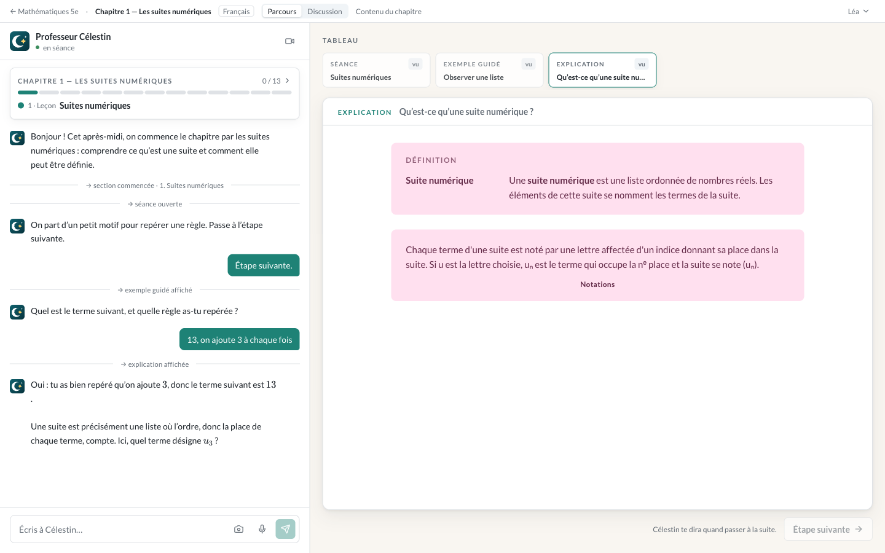

<div align="center">


# Célestin

**An AI tutor that teaches the course your teacher actually gave you.**

Drop in the notes, handouts and exercise sheets. Célestin turns them into a guided lesson, in your teacher's own
notation and vocabulary, and never hands over the answer.

[](https://github.com/eschnou/celestin/actions/workflows/image.yml)
[](LICENSE)
[](#quick-start)

[Quick start](#quick-start) · [Features](#features) · [How it works](#how-it-works) · [Configuration](#configuration) · [Documentation](#documentation)

</div>

---

<p align="center">
  
</p>

<p align="center"><sub>A lesson on sequences, taught from a student's own chapter: Célestin on the left, the board on the right quoting the course's definition and notation.</sub></p>

## Why Célestin

General chatbots give answers. Homework solvers show solutions. Neither teaches *your* course, in the notation your
teacher writes on the board, for the test you actually have on Thursday.

Célestin (named after the pedagogue Célestin Freinet) is built the other way round:

- **The student's material is the only source of content.** Célestin supplies the pedagogy, not the course. If your
  teacher writes `]−3; 3[` and `Sₙ = (u₁+uₙ)·n/2`, so does Célestin.
- **It withholds answers by construction.** While an exercise is open the tutor can explain, question and hint, but
  it cannot state the answer. The rule lives in the tools, not in a prompt that a persistent student could talk
  around.
- **It never grades from impression.** Verdicts come from a mechanical checker (numbers, expressions, intervals,
  choices) or an explicit rubric for free text, never from the model's prose.
- **It is a lesson, not a chat.** Célestin drives: it proposes the next step and moves through the chapter, writing
  and drawing on a whiteboard.

The design follows what the research says works: AI tutoring helps when it is designed around pedagogy and
withholds answers, and it hurts when it is an unrestricted chat. The full reasoning is in
[`specs/product.md`](specs/product.md).

## Features

**Bring your own course**
- Create a course (a name, a subject, a language), then add chapters by uploading **one PDF or photos of the
  pages**: typed notes, handwritten « cours à trous », exercise sheets, corrections.
- A vision model reads the pages (handwriting and formulas included, doubtful readings flagged). An authoring agent
  turns the text into a **course pack** (structured Markdown) and a **curriculum** (a locked path of lessons,
  practice and synthesis), validated and repaired mechanically. Your file itself is not kept.
- Everything is readable and editable. Edit the pack and Célestin follows.

**A real tutor**
- A **locked path** of `teach`, `practise` and `synthesis` sections; progress is saved per student and chapter.
- Explanations, worked examples (step by step, or « faded » so you supply a step), freshly generated exercises
  that are variants of your course's own samples, a three-level hint ladder, and gated, logged solution reveals.
- **Discussion mode**: a free conversation about the chapter, with the whiteboard, that can never move your
  progress.
- **Voice**: talk to Célestin instead of typing (OpenAI Realtime, same tools, same board).

**Your choice of AI**
- Runs on **OpenAI, Groq, OpenRouter, a local Ollama, vLLM or llama.cpp**: any OpenAI-compatible server. Pick the
  provider, give its address and key, and name a model for each job (teaching, preparing chapters, reading
  documents, voice), in the browser, with no restart. Each job can even use its own provider.
- A **test with live checks** tells you whether a model can actually teach (call the board's tool), prepare a
  course (follow a schema) and read a photo, before a student finds out.
- Open models work, with limits: see [what was verified on which model](documentation/ai-providers.md#compatibility).

**A board that draws**
- Maths rendered with KaTeX, and typed drawing blocks the tools validate and the board lays out in the course's
  notation: statistical charts, organigrammes, geometry figures, number lines, sets, and graphs of functions and
  sequences in a repère.

**Built for school**
- **Four subject categories**: mathematics, sciences (physics, chemistry, biology), languages (French and foreign
  languages) and general courses (history, geography and anything else learnt from the course). Each is a subject
  prompt and a pack template, in French and in English; the student's material carries the content.
- **French and English courses.** French courses follow Belgian (FWB) conventions: decimal commas, `]a; b[`,
  sequences from `u₁`. English courses use the international ones. The interface itself is French or English,
  independently.
- Private by design: a student's courses, material and progress are visible only to them. No third-party
  analytics.

**Easy to run**
- One Docker image, **no configuration needed**: the first visitor creates the administrator in the browser, and
  the AI provider is chosen and its key pasted in the settings screen (stored encrypted, changed without a
  restart).
- Accounts, an admin dashboard, and three registration modes (`open`, `closed`, `verification`).
- SQLite, automatic backup before every migration, multi-arch images (amd64 and arm64).

## Quick start

You need [Docker](https://docs.docker.com/get-docker/) and an AI provider: an [OpenAI](https://platform.openai.com/api-keys)
or [Groq](https://console.groq.com/keys) API key, or a model server of your own such as
[Ollama](https://ollama.com) (no key).

```sh
docker run -d --name celestin \
  -p 8080:8080 \
  -v ./data:/data \
  ghcr.io/eschnou/celestin:latest
```

Then:

1. Open <http://localhost:8080>. A fresh instance sends you to **/setup**.
2. Create the administrator account. **Do this right away**: the first visitor wins, and the page closes for good
   once an account exists.
3. On the dashboard, follow the banner to the settings, « AI provider »: pick **OpenAI**, **Groq**, **Ollama**… (one
   click fills the address and suggests models), paste your key, and save. It is checked with the provider, stored
   encrypted, and used immediately. « Test the connection », with its live check, tells you whether each model can
   do its job. Details and what was verified: [`documentation/ai-providers.md`](documentation/ai-providers.md).
4. Students register (or you create their accounts), create a course, drop in a chapter, and start learning.

That is the whole setup. Secrets are generated on first boot into `./data/secrets`; the database lives in
`./data/celestin.db`.

> **Pin a version for anything that matters.** Use `ghcr.io/eschnou/celestin:1.0` rather than `latest`: an upgrade
> runs database migrations on your volume (after an automatic backup).

### Docker Compose

```yaml
services:
  celestin:
    image: ghcr.io/eschnou/celestin:latest # pin a version tag
    ports:
      - "8080:8080"
    volumes:
      - celestin-data:/data
    restart: unless-stopped
    # environment:
    #   OPENAI_API_KEY: sk-...        # optional: wins over a key entered in the browser
    #   OPENAI_BASE_URL: https://api.groq.com/openai/v1   # another provider (a local Ollama: http://host.docker.internal:11434/v1)
    #   REGISTRATION_MODE: verification
    #   SITE_ADDRESS: celestin.example.com   # automatic HTTPS (publish ports 80 and 443)

volumes:
  celestin-data:
```

### Putting it on the internet

Célestin is meant to serve a class or a school, and it holds student accounts. Before exposing it:

- **Use HTTPS.** Set `SITE_ADDRESS=your.domain` and the bundled Caddy gets a certificate for you (publish ports 80
  and 443), or put your own TLS proxy in front.
- **Finish `/setup` first**, or start with `-p 127.0.0.1:8080:8080` and publish after, so a stranger cannot claim
  the administrator account.
- **Pick a registration mode**: `open` (default), `closed`, or `verification` (sign-up creates a disabled account an
  admin must enable).
- It is **one container, one worker, SQLite**: it serves a school or a class, not a platform. Back up the whole
  `/data` volume while the container is stopped; it contains the secrets as well, so treat it like the server.

Everything about the image, the data volume, upgrades, backups and operating it is in
[`documentation/docker.md`](documentation/docker.md).

### Your data and your AI provider

Célestin calls an AI provider to read documents, author chapters, teach and (optionally) speak. **With OpenAI, Groq
or any hosted provider, the pages a student uploads and their conversations are sent to that provider** under your own
account with it and its terms. **With a model server on your own machine (Ollama, vLLM, llama.cpp) nothing leaves
it.** Uploaded files are not stored by Célestin, and prompt content stays out of the logs unless you set
`DEBUG_LOG_PROMPTS=true`. Whoever runs an instance is responsible for informing its users, and, for minors, for the
consent that applies where you live. A smaller or open model teaches less well than a frontier one; the rules that
matter (answers withheld, verdicts from a checker, content from the student's own material) are enforced by the
application, not by the model.

## How it works

```
 PDF / photos ──▶ transcription ──▶ authoring agent ──▶ course pack  ─┐
 (student's        (page markers,    (restructures,      curriculum   ├─▶ Tutor ──▶ tools ──▶ board
  material)         handwriting       never adds)        (locked path)┘    ▲          (cards, drawings)
                    and doubt marked)                                      │
                                                       student's progress ─┘
```

1. **Transcribe.** A vision model reads every page into text; the text is the chapter's source and the student can
   correct it.
2. **Author.** In the background, an agent produces the pack and the curriculum, then validates them (every
   reference must point at an existing entry) and repairs them.
3. **Teach.** The tutor reads four prompt layers: the subject-neutral tutor prompt, the subject prompt, the
   chapter's pack and path overview, and the mode's own layer. It teaches by calling a fixed set of tools (plan,
   explain, worked example, set exercise, check, hint, discuss, reveal, record, recap), each rendered as a
   purpose-built card.
4. **Enforce.** Rules are enforced in the tools: the path is locked, answers are checked mechanically, no answer
   leaves while an exercise is open, formulas and vocabulary stay within the pack.

| Piece | Stack |
| --- | --- |
| Backend (`backend/`) | Python 3.12, FastAPI, SQLAlchemy and Alembic on SQLite, OpenAI-compatible Responses and Chat Completions APIs, OpenAI Realtime for voice |
| Frontend (`frontend/`) | React 19, TanStack Start, Vite, Tailwind v4, shadcn/ui, KaTeX, Paraglide (i18n) |
| Image | Caddy in front of a Node web server and a uvicorn tutor service, under `tini` |

## Configuration

Nothing is required. Every variable is optional and wins over what the interface stores.

| Variable | Default | What |
| --- | --- | --- |
| `OPENAI_API_KEY` | — | The provider's key. When set, it wins and the settings field becomes read-only. |
| `OPENAI_BASE_URL` | `https://api.openai.com/v1` | The provider's address: `https://api.groq.com/openai/v1`, `http://localhost:11434/v1` (Ollama)… |
| `REGISTRATION_MODE` | `open` | `open`, `closed` or `verification`. |
| `SITE_ADDRESS` | `:8080` | Set a host name for automatic HTTPS (Caddy). |
| `OPENAI_MODEL` | `gpt-6.1-sol` | The tutor model. Also `AUTHORING_MODEL`, `TRANSCRIPTION_MODEL` (must accept images) and `VOICE_MODEL`. |
| `SESSION_SECRET` | generated | Bring your own session secret (16+ characters). |
| `MAX_COURSES_PER_STUDENT`, `MAX_CHAPTERS_PER_COURSE` | `30`, `40` | Per-student limits. |
| `DOCUMENT_MAX_BYTES`, `DOCUMENT_MAX_PAGES` | 25 MB, 50 | Upload limits. |
| `DEBUG_LOG_PROMPTS` | `false` | Log prompt and pack content (off by default). |

The complete list (models, transcription settings, voice, limits) is in
[`documentation/running-locally.md`](documentation/running-locally.md).

## Run from source

For development. You need Python 3.12+ with [uv](https://docs.astral.sh/uv/) and Node 22+.

```sh
git clone https://github.com/eschnou/celestin.git && cd celestin

# terminal 1: the tutor service on :8000
cd backend
uv sync
uv run python -m scripts.migrate
uv run uvicorn app.main:create_app --factory --reload --port 8000

# terminal 2: the web app on :8080 (it proxies /api to the backend)
cd frontend
npm install
npm run dev
```

Open <http://localhost:8080>, create the administrator on `/setup`, and choose the AI provider and add its key in the settings. Over
plain `http://localhost`, set `COOKIE_SECURE=false` (or `auto`) in a `.env` file.

To try a lesson without spending anything on authoring, seed a student with the sample chapter
([`backend/tests/fixtures/chapters/suites/`](backend/tests/fixtures/chapters/suites/)):

```sh
cd backend
uv run python -m scripts.seed --email eleve@example.be --password 'a-strong-password'
```

**Tests and checks**

```sh
cd backend  && uv run pytest
cd frontend && npm run typecheck && npm run lint && npm test
docker build -t celestin:dev . && docker/smoke.sh celestin:dev     # what CI runs on the image
```

## Documentation

How the built system works lives in [`documentation/`](documentation/index.md), one file per area:
[accounts and courses](documentation/accounts-and-courses.md), [authoring](documentation/authoring.md),
[the tutor's turn pipeline](documentation/tutor-turn-pipeline.md), [discussion mode](documentation/discussion.md),
[voice](documentation/voice.md), [course language](documentation/course-language.md),
[interface language](documentation/i18n.md), [admin](documentation/admin.md),
[first-run setup](documentation/first-run-setup.md) and [Docker](documentation/docker.md).

The product brief is [`specs/product.md`](specs/product.md); every feature has its requirements, design and plan
under [`specs/`](specs/index.md).

## Roadmap

The four subject categories, the parcours, the discussion mode, voice, the board's drawings, French and English courses,
accounts and administration are built. Next:

- More subjects: chemistry, biology, history, mother tongue, foreign languages.
- **Révision mode**: the tutor tests you on a chapter or a whole course and helps you rehearse what is weak.
- Reading photographed handwritten work, step by step.
- Adding pages to an existing chapter without rebuilding it.
- A parent view.

Out of scope for now: teacher or classroom accounts, content we author ourselves, native mobile apps.

## Contributing

Issues and pull requests are welcome. Before starting something sizeable, open an issue to talk it through: features
are specified before they are built (see [`specs/`](specs/index.md)), and the invariants above (answers withheld by
the tools, mechanical verdicts, content restricted to the student's pack, privacy per student) are not negotiable,
so a change that bends one needs a conversation first. Run the tests and linters listed above, and keep
`documentation/` in step with what you change.

If you work with [Claude Code](https://claude.com/claude-code), [`CLAUDE.md`](CLAUDE.md) holds the repository's
conventions.

## License

[MIT](LICENSE) © 2026 Laurent Eschenauer.
