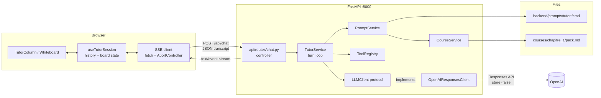

# 001 — Design: agentic tutor in the chat column

## 1. Overview

A new Python/FastAPI backend owns the tutor. It assembles the system prompt from an external file plus the chapter 1 course pack, runs a tool-calling loop against OpenAI's Responses API, and streams the result to the browser as Server-Sent Events. The React frontend keeps the whole conversation in memory, posts it back on every turn, and renders two things from the stream: text into the chat column, and board cards into the existing whiteboard components.

Shape of the solution:

- **Stateless backend.** No database, no session store, no `previous_response_id`. The client is the sole owner of conversation state; every request carries the full transcript. `store: false` on every provider call, so nothing is retained by OpenAI either.
- **Three layers.** Controllers handle HTTP and SSE framing only. Services own prompt assembly, the tool loop, and tool execution. A provider adapter isolates OpenAI behind a narrow interface, which is also what makes the tool loop testable without a network.
- **Structured board content, not Markdown.** Tool arguments describe cards as typed blocks. Nothing the model writes is ever turned into HTML, which removes the injection surface a Markdown renderer would introduce.

Key decisions and their rationale are collected in §10.

## 2. Architecture



**Runtime topology.** Two processes in development. Vite dev server on 5173 proxies `/api` to uvicorn on 8000, so the browser sees one origin and CORS never applies in the normal path. CORS middleware is still configured from an env var for the case where the two are served from different hosts.

**Repository layout.**

```
backend/
  pyproject.toml            # uv-managed, requires-python >=3.12
  app/
    main.py                 # app factory, middleware, router mounting
    config.py               # Settings (pydantic-settings), reads repo-root .env
    api/
      deps.py               # DI providers, singletons
      routes/
        health.py
        chat.py             # controller: validate, stream, translate errors
        courses.py          # controller: current-course metadata
      schemas/
        chat.py             # request/response DTOs
        board.py            # board card DTOs
        events.py           # SSE event DTOs
    services/
      tutor_service.py      # the turn loop
      prompt_service.py     # prompt assembly (pure)
      course_service.py     # pack accessor, mtime-cached
      history.py            # transcript -> provider input, trimming
      tools/
        registry.py         # tool declarations + dispatch
        board.py            # display_board / clear_board handlers
    providers/
      base.py               # LLMClient protocol + provider-neutral event types
      openai_responses.py   # the only OpenAI-aware module
    domain/
      transcript.py         # Entry union
      board.py              # BoardCard union
      errors.py             # TutorError hierarchy
  prompts/
    tutor.fr.md             # R1: the external prompt
  tests/
    unit/  integration/  fixtures/
```

Frontend additions:

```
frontend/src/
  lib/tutor/
    sse.ts                  # pure SSE frame parser
    client.ts               # POST + stream -> async iterable of TutorEvent
    types.ts                # mirrors backend DTOs
  components/celestin/
    use-tutor-session.ts    # history, board, send/cancel/retry
    board-blocks.tsx        # renders typed blocks incl. inline math
```

## 3. Components and Interfaces

### 3.1 REST API

Base path `/api`. JSON in, JSON out, except the chat stream.

| Method | Path | Purpose | Success | Body |
|---|---|---|---|---|
| GET | `/api/health` | liveness and readiness | 200 | `{status, model, pack_loaded}` |
| GET | `/api/courses/current` | course metadata for the shell | 200 | `{id, chapter_label, title}` |
| POST | `/api/chat` | run one turn | 200 `text/event-stream` | see §3.2 |

`/api/courses/current` returns metadata only. Pack content never crosses the wire (R2.5).

`POST /api/chat` is a POST that returns a stream rather than a resource, because the request body is too large for a URL and `EventSource` cannot POST. The turn is not addressable and nothing is stored, so there is no resource to `GET`.

Request body:

```json
{
  "history": [
    {"kind": "learner", "text": "ok"},
    {"kind": "tutor", "text": "Regarde à droite…"},
    {"kind": "tool", "name": "display_board", "arguments": {…}, "ok": true}
  ]
}
```

An empty `history` is valid and produces the opening turn (R3.8).

### 3.2 SSE protocol

Frames are `event: <name>\ndata: <json>\n\n`. A comment heartbeat `: ping` is emitted every 15 seconds so intermediaries do not close an idle stream. Response headers: `Cache-Control: no-cache`, `Connection: keep-alive`, `X-Accel-Buffering: no`.

| Event | Data | Frontend effect |
|---|---|---|
| `turn.start` | `{turn_id}` | mark the turn in flight |
| `text.delta` | `{block_id, text}` | append to the transcript entry keyed by `block_id`, creating it on first delta |
| `board.set` | `{card, marker}` | render the card, push it onto the history strip, insert the marker entry |
| `board.clear` | `{marker}` | empty the board, insert the marker entry |
| `turn.end` | `{reason, usage}` | clear in-flight state; `reason` is `end`, `max_rounds`, or `cancelled` |
| `error` | `{code, message}` | insert a French error entry, keep the transcript intact |

`block_id` gives R6.4 its ordering guarantee: each contiguous run of model text between tool calls is one block, so text before, between, and after tool calls lands as separate ordered entries.

`marker` carries the French label the transcript shows (R5.2). The backend owns the wording because it owns the tool semantics.

### 3.3 Provider interface

`app/providers/base.py` defines the only contract the tutor loop depends on. Nothing above it may import `openai`.

```python
class LLMClient(Protocol):
    def stream(
        self,
        *,
        input: list[ProviderItem],
        tools: list[ToolDeclaration],
    ) -> AbstractAsyncContextManager[AsyncIterator[ProviderEvent]]: ...
```

`ProviderEvent` is a provider-neutral union: `TextDelta(text)`, `ToolCallRequested(call_id, name, arguments_json)`, `Completed(usage)`, `Failed(code, message)`. The OpenAI adapter maps Responses API streaming events onto it:

| Responses API event | ProviderEvent |
|---|---|
| `response.output_text.delta` | `TextDelta` |
| `response.function_call_arguments.delta` | buffered, not emitted |
| `response.function_call_arguments.done` | `ToolCallRequested` |
| `response.completed` | `Completed` |
| `response.failed`, `error` | `Failed` |

Arguments are buffered until `.done` rather than streamed, because a tool cannot execute on partial JSON and the UI shows a marker, not the arguments.

### 3.4 Services

**PromptService.build(history) -> list[ProviderItem]** is pure given the prompt text and pack text handed to it, so it is directly unit-testable (NFR 4.1.4). It produces, in order:

1. A `developer` message whose content is the prompt file with the pack substituted at its insertion point, carrying a `prompt_cache_breakpoint`.
2. The mapped transcript.

Ordering matters for cost: see §7.

**CourseService.get_pack()** reads `courses/chapitre_1/pack.md` and caches it in memory keyed by mtime, so editing the file is picked up on the next request with no restart (R1.4, R2.2). It is the single hardwired accessor; swapping it for course lookup touches nothing else. Failure raises `PackUnavailable`, which the controller turns into a 500 before any stream starts (R2.3).

**history.to_provider_input(entries)** maps the transcript DTO onto provider items:

- `learner` → user message
- `tutor` → assistant message
- `tool` → a `function_call` item plus its `function_call_output` item, with a synthesized deterministic `call_id` of `call_{index}`. Provider call ids are never persisted or sent to the client; they only need to be internally consistent within one request.

It also enforces the trimming policy in §7.

**ToolRegistry** declares both tools and dispatches by name. A tool is a declaration (name, description, JSON schema, strict flag), a Pydantic argument model, and a handler. Adding a tool means adding one module entry and touches neither the controller nor the provider (NFR 4.1.3). Declaration order is fixed, because tool definitions sit inside the cached prefix.

**TutorService.run_turn(history) -> AsyncIterator[TurnEvent]** is the loop:

```
items = PromptService.build(history)
for round in range(MAX_TOOL_ROUNDS):
    async with llm.stream(input=items, tools=registry.declarations()) as stream:
        async for ev in stream:
            TextDelta        -> yield text.delta(block_id, text)
            ToolCallRequested-> collect
            Failed           -> yield error; return
    if no calls collected:
        yield turn.end("end"); return
    for call in calls:
        parsed = registry.validate(call)          # Pydantic
        result = await registry.execute(parsed)   # yields board.set / board.clear
        items += [function_call, function_call_output]
    block_id += 1
yield turn.end("max_rounds")
```

Board tools have no server-side effect. Their handler validates the arguments and returns the card DTO to be emitted; the browser holds the board. The tool result sent back to the model is `{"ok": true}`, or the validation error text on failure (R4.6), which gives the model a chance to correct itself within the same turn.

### 3.5 Controller

`chat.py` does four things and nothing else: validate the request DTO, obtain the service, wrap `run_turn` in an SSE generator, and translate exceptions raised before the first byte into HTTP status codes. Once the stream has started the status is already 200, so later failures become `error` events instead (§5).

Client disconnect is detected two ways: the generator receives `GeneratorExit`/`CancelledError` on abort, and `await request.is_disconnected()` is checked between rounds so a long turn does not keep calling the provider after the learner has left. Both paths close the provider stream in a `finally` block.

### 3.6 Frontend

**`lib/tutor/sse.ts`** is a pure function from a chunk string plus carry-over buffer to parsed frames. No I/O, so it is testable against recorded fixtures.

**`lib/tutor/client.ts`** posts the transcript, reads `response.body` through a `TextDecoder`, feeds the parser, and yields typed events. Takes an `AbortSignal`.

**`use-tutor-session.ts`** owns all state for the page load (R8.1):

```ts
{
  entries: TranscriptEntry[]      // learner | tutor | marker | error
  board: BoardCard | null
  boardHistory: BoardCard[]
  status: "idle" | "streaming" | "error"
  send(text: string): void
  cancel(): void
  retry(): void
}
```

Text deltas are accumulated into a ref and flushed on animation frames, so a fast stream does not re-render the transcript per token (NFR 4.2.2). It fires the opening turn on mount when `entries` is empty.

**`board-blocks.tsx`** renders typed blocks. Text blocks are split on `$…$` and the segments handed to the existing `Math` component; everything else is plain React text nodes. No `dangerouslySetInnerHTML` beyond KaTeX's own output, which runs with `trust: false`.

**Existing components.** `tutor-column.tsx` swaps its mock `conversation` import for the hook and gains cancel and retry affordances. `whiteboard.tsx` takes the current card as a prop and renders the matching component, falling back to the mock boards when the tutor has not written anything (R4.8). The mock data in `session.ts` stays. The session plan card, camera, and mic remain inert.

## 4. Data Models

### 4.1 Transcript (wire DTO)

```python
class LearnerEntry(BaseModel):
    kind: Literal["learner"]
    text: str = Field(max_length=settings.max_message_chars)

class TutorEntry(BaseModel):
    kind: Literal["tutor"]
    text: str

class ToolEntry(BaseModel):
    kind: Literal["tool"]
    name: str
    arguments: dict[str, Any]
    ok: bool
    error: str | None = None

Entry = Annotated[LearnerEntry | TutorEntry | ToolEntry, Field(discriminator="kind")]

class ChatRequest(BaseModel):
    history: list[Entry] = Field(max_length=settings.max_history_entries)
```

Markers and error entries are client-side presentation and are not sent back.

### 4.2 Board cards

One discriminated union, mirroring the six existing card components. Inline maths inside any `text` field uses `$…$`; `tex` fields are raw LaTeX.

```python
class TextBlock(BaseModel):    type: Literal["text"];    text: str
class FormulaBlock(BaseModel): type: Literal["formula"]; tex: str; caption: str | None = None
class QuoteBlock(BaseModel):   type: Literal["quote"];   tex: str; caption: str   # the course-quote style
class NoteBlock(BaseModel):    type: Literal["note"];    label: str; text: str

Block = Annotated[TextBlock | FormulaBlock | QuoteBlock | NoteBlock, Field(discriminator="type")]

class TitleCard:         kind="title";          eyebrow: str; title: str; objective: str
class ExplanationCard:   kind="explanation";    title: str; blocks: list[Block]
class WorkedExampleCard: kind="worked_example"; title: str; statement: str; steps: list[Step]  # Step{tex, note?}
class ExerciseCard:      kind="exercise";       title: str; statement: str; hint: str | None
class CheckQuestionCard: kind="check_question"; question: str; options: list[Option]; correct_option_id: str; feedback: str
class RecapCard:         kind="recap";          acquired: list[str]; watch: list[str]; next: str
```

Constraints enforced by the models, not by the prompt: two to four options on a check question, `correct_option_id` must exist in `options`, one to eight steps on a worked example, non-empty strings. A violation is a tool error (R4.6).

### 4.3 Tool declarations

```
display_board(card: BoardCard)   strict = false
clear_board()                    strict = true
```

`display_board` is declared with `strict: false` because a discriminated union over six card shapes is not reliably expressible under strict mode's requirement that every field be required with `additionalProperties: false`. Validation is ours regardless (NFR 4.3.5), so strict mode would buy schema conformance we already enforce. If the model proves unreliable at picking the right shape, the fallback is six per-kind tools with strict schemas; that is a change confined to the registry.

### 4.4 Domain errors

```python
TutorError
├── PackUnavailable          500 pack_unavailable
├── PromptUnavailable        500 prompt_unavailable
├── ProviderUnavailable      502 provider_unavailable
├── ProviderRateLimited      429 provider_rate_limited
├── ProviderTimeout          504 provider_timeout
└── ToolValidationError      (never surfaces as HTTP; returned to the model)
```

## 5. Error Handling

Two regimes, split by whether the response has started.

**Before the first byte.** Configuration and resource failures become HTTP status codes with a JSON body `{code, message}`. A missing API key fails at startup, not on first request (NFR 4.3.2). A missing or unreadable pack or prompt file is a 500 and the turn never begins (R2.3).

**After the stream opens.** The status line is already sent, so every failure becomes an `error` SSE event followed by `turn.end`. This includes provider errors mid-generation, timeouts, and unexpected exceptions. The frontend inserts a French entry and keeps the transcript, so the learner's message survives and can be retried without retyping (R7.3).

**Tool failures are not errors.** Invalid arguments produce a `function_call_output` carrying the validation message, and the loop continues. The model gets to correct itself. Only if it exhausts `MAX_TOOL_ROUNDS` does the turn end with `reason: max_rounds` and a French notice (R6.3). An unknown tool name is handled the same way.

**Cancellation.** The client aborts; the generator's `finally` closes the provider stream. Text already streamed stays in the transcript, marked interrupted (R7.1). No board mutation is rolled back, because a failed turn cannot have mutated server state (R7.5).

**Errors never leak internals.** Client-visible messages are French and generic. Stack traces, prompt content, pack content, and key material stay in server logs (NFR 4.3.6).

## 6. Testing Strategy

The provider interface exists so that the whole backend can be tested without a network call.

**Unit.**
- `PromptService.build` against a fixture prompt and pack: insertion point substituted, developer message first, cache breakpoint present.
- `history.to_provider_input`: role mapping, call-id pairing, trimming policy, and the rule that a `function_call` is never emitted without its output.
- Tool argument validation: each card kind, plus the constraint violations in §4.2.
- SSE serialization: event names and JSON shape.
- Frontend `sse.ts` against recorded byte fixtures, including frames split across chunk boundaries.

**Turn loop, with a `FakeLLM`.** A scripted `LLMClient` that replays a list of `ProviderEvent`s drives the cases that matter: text only; text then one tool call then text; parallel tool calls in one round; invalid arguments followed by a corrected retry; round limit exhausted; provider failure mid-stream; disconnect mid-round.

**API integration.** `httpx.AsyncClient` over `ASGITransport` against the app with `FakeLLM` injected, asserting the full SSE transcript for a scripted turn. These golden transcripts are the contract the frontend codes against; a change to them is a change to §3.2.

**Live smoke test.** One opt-in test, skipped unless `RUN_LIVE_TESTS=1`, that runs a real turn and asserts a board card comes back. It is not in the default run and is not in CI.

Stack: pytest, pytest-asyncio, httpx. No database means no fixtures beyond files.

## 7. Performance

**Streaming end to end.** The controller yields as the provider yields; nothing buffers a whole reply. `AsyncOpenAI` throughout, so a slow provider does not block the event loop.

**Prompt caching is the main cost lever.** The stable prefix is roughly 9k tokens: about 8.1k for the pack and the rest for the prompt and tool declarations. OpenAI's automatic caching needs 1024+ tokens and matches on exact prefix, so the assembly order is load-bearing:

1. developer message = prompt + pack, marked with `prompt_cache_breakpoint`
2. tool declarations, in fixed order
3. transcript, oldest first

The prompt goes in a developer message rather than the top-level `instructions` field, because `instructions` cannot carry a cache breakpoint. Anything varying per request must sit after the breakpoint. Cache reads bill at 0.1× and writes at 1.25×, so a session of n turns pays the prefix roughly once instead of n times. Verified through `usage.input_tokens_details.cached_tokens`, which is logged per turn; a persistent zero means something upstream of the breakpoint is varying.

**History trimming** (NFR 4.2.4). The prefix is never trimmed. The transcript is trimmed oldest-first until the estimated token count fits `HISTORY_TOKEN_BUDGET`, default 30k, with two invariants: a `tool` entry is never separated from the turn that produced it, and the most recent learner message is always kept. Estimation is characters divided by a French-tuned constant, not a tokenizer, because the budget is an order-of-magnitude guard rather than a hard limit. Trimming is logged.

**Pack reads.** Cached by mtime, so at most one read per edit rather than one per request (NFR 4.2.3).

**Rendering.** Deltas accumulate in a ref and flush on animation frames; transcript entries are keyed and memoized so a delta re-renders one entry, not the conversation.

**Model choice.** Default `gpt-5.6-terra`, the balanced tier, set through `OPENAI_MODEL`. The tutor's job is instruction-following and correct tool arguments over a long stable prompt rather than hard reasoning, and cost per turn is dominated by the cached prefix. `gpt-6-astra` is the escalation if pedagogical quality disappoints; `gpt-5.6-luna` is the option if latency does.

## 8. Security

- **Key handling.** Read from the repo-root `.env` through pydantic-settings. It is gitignored, with `.env.example` listing the name. The key never leaves the backend process, is never logged, and never appears in a response body.
- **Startup validation.** A missing key aborts startup with an explicit message rather than failing on the first learner message.
- **Input caps, server-side.** `max_message_chars` per learner message, `max_history_entries` per request, and a request body size limit. Violations are 422 or 413 before any provider call (NFR 4.3.3).
- **Model output is untrusted.** Tool arguments are validated by Pydantic before use. More importantly, no model-authored string is ever interpreted as markup: board content is structured blocks rendered as React text nodes, and the only HTML generated from model input is KaTeX's, with `trust: false`. This is why §4.2 uses typed blocks instead of the Markdown body the requirements described; see §10.
- **CORS.** Denied by default. `CORS_ORIGINS` lists dev origins explicitly. The proxy path means the browser normally sees one origin.
- **CSRF.** The frontend keeps calling through its own origin via the proxy, so the existing TanStack Start middleware still fronts anything served from the app. The backend accepts JSON only and reads no cookies, so it carries no ambient authority to forge.
- **No retention.** `store: false` on every provider call. The product brief's privacy stance is that the parent owns the data; nothing is written anywhere in this feature.
- **Logging discipline.** Prompt and pack content are logged only behind `DEBUG_LOG_PROMPTS`, off by default.

## 9. Monitoring and Observability

- **Structured JSON logs**, one line per event, carrying `request_id` and `turn_id`. Per turn: model, round count, tool calls with name and validation outcome, `reason` at end, latency to first token, total latency, and the full `usage` block including `cached_tokens`.
- **Latency to first token** is the number that tracks the learner's experience; it is logged separately from total turn latency.
- **Cache hit rate** derived from `cached_tokens / input_tokens`. A drop signals prefix drift and is the first thing to check when cost rises.
- **Tool validation failures** are logged at warning with the offending field path. A recurring failure on one card kind is the trigger to split `display_board` into per-kind strict tools (§4.3).
- **`/api/health`** reports model id and whether prompt and pack loaded, so a misconfigured path is visible without sending a message.
- No metrics backend, no tracing, no analytics. The product brief rules out third-party analytics, and a single-user POC does not justify a collector.

## 10. Decisions and deviations

1. **Structured blocks instead of Markdown board content.** R4.2 described the explanation body as Markdown. Design uses typed blocks. Reason: rendering model-authored Markdown requires an HTML pipeline and a sanitizer, which adds an injection surface and three dependencies to display content whose shape is already fixed by the card design. Inline maths within a text block keeps the `$…$` convention. Requirement intent is preserved; the encoding differs.
2. **Two tools, `strict: false` on the union.** Follows R4.1. The strict-mode alternative is six tools, held as the documented fallback rather than the starting point.
3. **Backend owns marker wording.** R5.2 asks for French labels; the backend knows tool semantics, so it emits the label rather than the frontend inferring it from the event type.
4. **Deterministic synthesized `call_id`s.** The transcript DTO stays provider-neutral. Provider identifiers are an implementation detail of one request and never reach the client.
5. **POST returning a stream.** Not a resource-shaped endpoint, justified in §3.1. The other two endpoints are conventional REST.
6. **No `previous_response_id`.** It would make OpenAI the session store, contradicting R8.2 and the brief's privacy stance, and would tie conversation state to one provider.
7. **Prompt in a developer message, not `instructions`.** Forced by the cache-breakpoint rule in §7. This is the single most consequential detail for cost.
8. **Frontend holds board state.** The backend emits cards and forgets them. This keeps R8.2 literally true and means a failed turn cannot corrupt the board.
