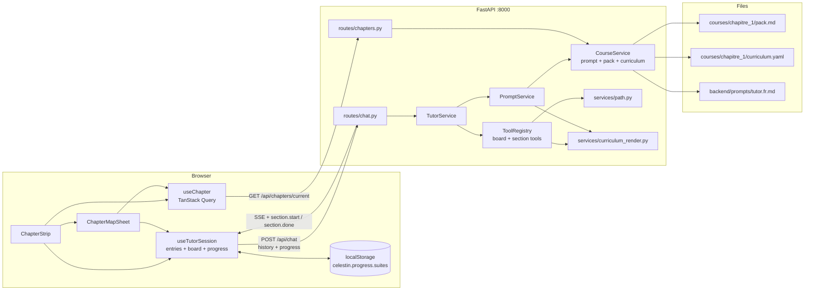

# 002 — Design: a chapter as a locked path of sections

## 1. Overview

A chapter is two files: `pack.md` (the course, unchanged in shape) and `curriculum.yaml` (an ordered list of sections). The backend loads both through the existing course accessor. The curriculum's static overview joins the cached prompt prefix; each section's brief reaches the model through a `start_section` tool result. Progress lives in the browser as `{done, active}`, is posted with every turn, and is updated only by two new SSE events. The locked path is enforced in the tool layer as a pure function of curriculum and progress; the backend stays stateless.

Two surfaces show progress. A **chapter strip** sits permanently under the tutor header, where the mock session plan is today: chapter title, a segmented bar with one segment per section, the active section's number, kind and title. Tapping it opens the **chapter map**, a sheet listing every section with its state, from which the learner can ask to review a done section, start the next one, or reset the chapter. Section start and end also land in the transcript as markers.

Two "material" APIs, kept apart on purpose:

- `GET /api/chapters/current` gives the browser the chapter overview (sections with id, kind, title, goal) to draw the strip and the map. No beats, no exercises, no pack.
- `start_section` gives the model the section brief (beats or exercise pool, count, completion criterion). Course content itself stays where it is, in the cached prefix; the brief tells the tutor which part of it to use now.

## 2. Architecture



Runtime topology is unchanged: Vite proxies `/api` to uvicorn. No database, no session store.

## 3. Components and Interfaces

### 3.1 HTTP API

| Method | Path | Purpose | Success |
|---|---|---|---|
| GET | `/api/chapters/current` | chapter overview for the strip and the map | 200 |
| POST | `/api/chat` | one turn; body gains `progress` | 200 `text/event-stream` |
| GET | `/api/health` | gains `curriculum_loaded` and `sections` | 200 |

`GET /api/courses/current` is removed. Nothing in the frontend calls it, and "chapter" is the vocabulary the product uses.

`GET /api/chapters/current` response:

```json
{
  "id": "suites",
  "title": "Les suites numériques",
  "sections": [
    {"id": "suites", "index": 1, "kind": "teach", "title": "Suites numériques", "goal": "…"},
    {"id": "sa-definition", "index": 2, "kind": "teach", "title": "…", "goal": "…"}
  ]
}
```

`index` is 1-based and is the number shown in the interface. Beats, exercise pools and `done_when` are not in the response (NFR 4.3.3). The response carries `Cache-Control: no-store`; the file is small and editable, and the client fetches it once per page load.

`POST /api/chat` body:

```json
{
  "history": [...],
  "progress": {"done": ["suites", "sa-definition"], "active": "sa-terme"}
}
```

`progress` defaults to `{"done": [], "active": null}` so a client without stored progress starts at section 1.

### 3.2 SSE protocol

Two events added to the contract in 001 §3.2. Frontend types, golden transcript tests and the pipeline doc change together.

| Event | Data | Frontend effect |
|---|---|---|
| `section.start` | `{section_id, review, marker}` | if not `review`, set `progress.active`; insert the marker |
| `section.done` | `{section_id, next_section_id, marker}` | add to `progress.done`, clear `active`; insert the marker |

Markers, owned by the backend: « section commencée · 5. Suites arithmétiques — somme de n termes », « révision · 2. … », « section terminée · 5. … ».

### 3.3 CourseService

Gains a third mtime-cached file and one method:

```python
class CourseService:
    def __init__(self, pack_path, prompt_path, curriculum_path): ...
    def get_curriculum(self) -> Curriculum        # parsed + validated, cached by mtime
    def is_available(self) -> bool                # all three files
    def get_meta(self) -> ChapterMeta             # id, title, sections overview
```

`Settings` gains `curriculum_path`, defaulting to `courses/chapitre_1/curriculum.yaml`, validated like the other two paths. `create_app` calls `get_curriculum()` once at startup so a broken file fails the process with the file and section named (R2.6).

### 3.4 Path rules

`app/services/path.py`, pure, no I/O:

```python
State = Literal["done", "active", "available", "locked"]

def section_states(curriculum: Curriculum, progress: Progress) -> dict[str, State]
def can_start(curriculum, progress, section_id) -> Refusal | None
def can_complete(curriculum, progress, section_id) -> Refusal | None
def next_section(curriculum, progress) -> Section | None
```

Rules, from R3:

- `done` if in `progress.done`; `active` if `progress.active`; else the first remaining section in curriculum order is `available` when nothing is active, and every later one is `locked`.
- `can_start`: `available`, `active` or `done` pass. `locked` fails with « La section « … » n'est pas encore ouverte. Tu peux commencer « … ». » naming the available or active section.
- `can_complete`: only `active` passes. Otherwise « Seule la section en cours peut être terminée : « … ». » or, with nothing active, « Aucune section n'est en cours. Commence-en une avec start_section. »
- `Refusal` is a frozen dataclass with the French message; the tool turns it into `ToolValidationError`.

### 3.5 Curriculum rendering

`app/services/curriculum_render.py`, pure functions returning text the model reads:

- `overview(curriculum) -> str`: numbered list, one line per section: `5. sa-somme (cours) — Suites arithmétiques — somme de n termes. Connaître Sₙ = …`. Substituted at `<!-- CURRICULUM -->` in the prompt. Byte-stable per file, so it belongs in the cached prefix.
- `brief(section, index, total, review) -> str`: what `start_section` returns. Teach sections list beats numbered; practise and synthesis list the exercise pool and `count`; every brief ends with « Terminée quand : … ». A review prepends « Révision : cette section est déjà faite ; ne la termine pas à nouveau. »
- `state_message(curriculum, progress) -> str`: the short developer message appended after the transcript (§3.7).

### 3.6 Section tools

`app/services/tools/section.py`, registered after `clear_board`, both `strict: true`. The board declarations are untouched, so their bytes in the prefix do not move (R4.5).

| Tool | Arguments | On success | On refusal |
|---|---|---|---|
| `start_section` | `section_id` | `SectionStarted(section, index, review)`; tool output = brief | `ToolValidationError(refusal.message)` |
| `complete_section` | `section_id`, `summary` (1–300 chars) | `SectionCompleted(section, index, next)`; tool output = « Section terminée. Prochaine section : 6. … » or « Chapitre terminé. » | `ToolValidationError(refusal.message)` |

Handlers need the request's progress, so the registry signature becomes `execute(name, arguments_json, ctx: TurnContext)`. `TurnContext` holds `curriculum` and a mutable `progress`; board handlers ignore it. `TutorService` applies a successful section outcome to `ctx.progress` before the next call, so « complete 5 then start 6 » inside one turn sees the updated state.

The tool output that goes back to the model is no longer always `{"ok": true}`: `ToolOutcome` gains `output: str | None`, and `_tool_output` sends `{"ok": true, "result": output}` when present.

### 3.7 Prompt assembly

`PromptService.build(prompt_text, pack_text, curriculum, progress, history_items)`:

1. Developer message: prompt with `<!-- COURSE_PACK -->` and `<!-- CURRICULUM -->` substituted, carrying the cache breakpoint. Both markers are required; a missing one raises `PromptUnavailable`.
2. The mapped transcript.
3. A developer message with `state_message(curriculum, progress)`, last:

```
État du parcours : 4 sections faites sur 13.
Section en cours : 5. Suites arithmétiques — somme de n termes (cours).
Si tu n'as pas encore son plan dans cette conversation, appelle start_section("sa-somme").
```

or with nothing active: « Aucune section en cours. Prochaine : 6. … (exercices). Commence-la avec start_section("sa-applications"). » or « Chapitre terminé. Propose une révision. »

Placed after the transcript, it changes every turn without touching the cached prefix.

`prompts/tutor.fr.md` gains the `<!-- CURRICULUM -->` marker and a section « Le parcours » covering: opening a session from the state message (R6.3); per-kind behaviour (R8); reviews (R6.4); « une section n'est terminée que par complete_section, et seulement quand son critère est atteint » (R6.5); « l'outil te dira si une section n'est pas encore ouverte ». « Le début d'une séance » is rewritten: greet, one sentence on where she is, start the section, first card. No agenda negotiation.

### 3.8 Replay of section tool results

`history.to_provider_input(entries, budget, ctx)` currently emits `{"ok": true}` for every replayed tool entry. For section tools it must reproduce the brief, or the model loses the beats on the next message (R4.4). The registry gains `replay_output(name, arguments, ctx) -> dict`: section tools recompute the brief from the curriculum (a pure function of the section id), board tools return `{"ok": true}`. Replay does not re-check the path; the entry's `ok` flag says what happened at the time, and a refused call replays as `{"ok": false, "error": …}` as today.

Replay uses the curriculum, not the progress, so a section renamed in the file mid-session simply replays with the new text.

### 3.9 Frontend: data

`lib/tutor/types.ts`:

```ts
export type SectionKind = "teach" | "practise" | "synthesis";
export type SectionOverview = { id: string; index: number; kind: SectionKind; title: string; goal: string };
export type Chapter = { id: string; title: string; sections: SectionOverview[] };
export type Progress = { done: string[]; active: string | null };
export type SectionState = "done" | "active" | "available" | "locked";
```

`TutorEvent` gains the two events. `HistoryEntry` is unchanged. `client.ts` posts `{history, progress}`.

`lib/tutor/chapter.ts`: `fetchChapter()` and `useChapter()` (TanStack Query, `queryKey: ["chapter"]`, `staleTime: Infinity`). The provider is already mounted in `__root.tsx`.

`lib/tutor/path.ts`: `sectionStates(chapter, progress)` mirroring §3.4 for display only. The backend is the authority; the mirror only colours rows.

`lib/tutor/progress-store.ts`: `loadProgress(chapterId)` and `saveProgress(chapterId, progress)` over `localStorage` key `celestin.progress.<chapterId>`. Both wrapped in try/catch; unknown or malformed values yield the empty progress with a `console.warn`. Ids not in the chapter are dropped at load.

### 3.10 Frontend: session hook

`SessionState` gains `progress: Progress`. `reduce` handles:

- `section.start`: `review ? state : {...state, progress: {...progress, active: section_id}}`, plus a marker entry with `boardIndex: null`, plus a `tool` history entry `{name: "start_section", arguments: {section_id}}`.
- `section.done`: move the id into `done`, `active: null`, marker, history entry `{name: "complete_section", arguments: {section_id, summary: ""}}`. The summary is not echoed by the event; the replay output is recomputed server-side, so the argument value is immaterial.

`useTutorSession(chapterId)`:

- initialises `progress` from the store once the chapter is known, then fires the opening turn. The opening turn waits for the chapter query so the request carries restored progress (R5.4). If the query fails, the opening turn still fires with empty progress and the strip shows an error state.
- writes progress to the store in an effect keyed on `state.progress`.
- exposes `progress`, `resetProgress()`: clears the store, resets `progress`, aborts any stream, and restarts the conversation (same effect as a reload).

`send(text)` is reused by the map for review and start requests, and by the check-question card for answers.

### 3.11 Frontend: where progress is displayed

Three places, one source of truth (`progress` in the hook, `chapter` from the query).

**ChapterStrip** (`components/celestin/chapter-strip.tsx`), replaces `SessionPlan` under `TutorHeader`. About 72 px tall, so the transcript keeps its room in the 35 % column:

```
┌──────────────────────────────────────────────┐
│ LES SUITES NUMÉRIQUES              4 / 13  › │
│ ▇▇▇▇▇▇▇▇▇▇▇▇▇▇▇▇▇▇▇▇▇▇▇▇▇▇▇▇▇▇▇░░░░░░░░░░░░ │  13 segments: done / active / rest
│ ● 5 · Cours   Suites arithmétiques — somme…  │  active section, one line, truncated
└──────────────────────────────────────────────┘
```

Segments use theme tokens: `success` for done, `primary` for active (pulsing while streaming is not needed; a solid fill is enough), `border` for locked and available. The whole strip is a button labelled « Voir le parcours du chapitre » that opens the sheet. With no active section it reads « ○ À suivre · 6 · Exercices   … » ; with the chapter complete, « ✓ Chapitre terminé ».

**ChapterMapSheet** (`components/celestin/chapter-map.tsx`), shadcn `Sheet`, side `left`, full height, width 380 px on desktop and full width below `lg`:

```
Les suites numériques                          4 sections faites sur 13
──────────────────────────────────────────────────────────────────────
 ✓  1  COURS      Suites numériques                       [Revoir]
 ✓  2  COURS      Suites arithmétiques — définition et uₙ [Revoir]
 ✓  3  EXERCICES  Suites arithmétiques — calculer un terme[Revoir]
 ✓  4  COURS      Suites arithmétiques — graphique et …   [Revoir]
 ●  5  COURS      Suites arithmétiques — somme de n termes
       │          Connaître Sₙ = (u₁ + uₙ)·n/2 et savoir reproduire sa démonstration.
 ○  6  EXERCICES  Suites arithmétiques — applications     à suivre
 🔒 7  COURS      Suites géométriques — définition, uₙ …
 🔒 …
──────────────────────────────────────────────────────────────────────
                                    Recommencer le chapitre (menu, confirm)
```

A vertical rail joins the state dots, `primary` down to the active row and `border` after. Rows are `<li>` with a button only where an action exists: « Revoir » on done rows sends « Je voudrais revoir la section « {title} ». » ; the available row, when nothing is active, sends « On commence la section « {title} » ? ». Locked rows are plain, `aria-disabled`, dimmed. The active row shows its goal. Buttons are disabled while a turn streams. « Recommencer le chapitre » sits in a `DropdownMenu` behind an `AlertDialog` (« Tout le parcours sera remis à zéro. »). The sheet closes after any action.

**Transcript markers** (`Entry` in `tutor-column.tsx`): the existing marker style, `boardIndex: null`, so a section start reads as a line in the conversation where it happened.

Not chosen: a persistent full list in the column (13 rows do not fit above the transcript on a laptop), a rail on the whiteboard (the board is for content, and the strip already sits next to the conversation the tutor drives), and a `chapter_map` board card (the model would call it inconsistently, and the map must be reachable at any time, not only when the tutor shows it).

Below `lg` the strip stays above the chat panel and the sheet is full width, so the phone layout gets the same two surfaces.

### 3.12 Check-question answers

`CheckQuestionBoard` takes `onAnswer?: (option: Option, correct: boolean) => void`. `Whiteboard` forwards it; the route wires it to `session.send` with « Ma réponse à la question : « {option.text} ». ». The card keeps its local feedback. The handler fires once per card; a second pick after a wrong answer sends again, which is what the tutor wants to see.

## 4. Data Models

### 4.1 Curriculum (`app/domain/curriculum.py`)

```python
Kind = Literal["teach", "practise", "synthesis"]
Text = Annotated[str, Field(min_length=1, max_length=600)]

class Section(_Model):                       # extra="forbid"
    id: Annotated[str, Field(pattern=r"^[a-z0-9][a-z0-9-]{1,39}$")]
    kind: Kind
    title: Text
    goal: Text
    done_when: Text
    pack: list[Text] = []                    # informative pack references
    beats: list[Text] = []                   # teach: required, 1..12
    exercises: list[Text] = []               # practise/synthesis: required, 1..12
    count: Annotated[int, Field(ge=1, le=10)] | None = None   # practise/synthesis: required

    # model_validator: teach ⇒ beats and no exercises/count;
    #                  otherwise ⇒ exercises and count and no beats.

class Curriculum(_Model):
    id: Annotated[str, Field(pattern=r"^[a-z0-9][a-z0-9-]{1,39}$")]
    title: Text
    pack: str
    sections: Annotated[list[Section], Field(min_length=1, max_length=40)]
    # model_validator: ids unique.
```

Parsed from YAML with `yaml.safe_load`; a non-mapping document or a validation error becomes `CurriculumInvalid(path, detail)`.

### 4.2 Progress (`app/api/schemas/chat.py` and `app/domain/progress.py`)

```python
class ProgressDTO(_Model):
    done: Annotated[list[str], Field(max_length=40)] = []
    active: str | None = None

class ChatRequest(_Model):
    history: ... = []
    progress: ProgressDTO = ProgressDTO()
```

`Progress` (domain) is a frozen dataclass `done: frozenset[str]`, `active: str | None`. `progress.normalise(dto, curriculum)` drops unknown ids and duplicates; `active` also present in `done`, or unknown, raises `InvalidProgress` (422).

### 4.3 Chapter meta (`app/api/schemas/chapter.py`)

`ChapterResponse {id, title, sections: [SectionOverviewDTO {id, index, kind, title, goal}]}`, built from `Curriculum` by the route.

### 4.4 Tool arguments and outcomes (`app/services/tools/section.py`)

```python
class StartSectionArgs(_Model):    section_id: str
class CompleteSectionArgs(_Model): section_id: str; summary: Annotated[str, Field(min_length=1, max_length=300)]

@dataclass(frozen=True) class SectionStarted:   section: Section; index: int; review: bool; output: str
@dataclass(frozen=True) class SectionCompleted: section: Section; index: int; next: Section | None; output: str
```

`ToolOutcome = BoardSet | BoardCleared | SectionStarted | SectionCompleted`.

### 4.5 Events (`app/api/schemas/events.py`)

```python
class SectionStartEvent(BaseModel): event: Literal["section.start"]; section_id: str; review: bool; marker: str
class SectionDoneEvent(BaseModel):  event: Literal["section.done"];  section_id: str; next_section_id: str | None; marker: str
```

### 4.6 Browser storage

Key `celestin.progress.<chapter id>`, value `{"done": string[], "active": string | null, "v": 1}`. `v` lets a later shape change discard old values instead of misreading them.

## 5. Error Handling

| Where | Condition | Handling |
|---|---|---|
| Startup | curriculum missing, unparseable, or invalid | `create_app` raises with file path and the failing section id; process exits, like a missing API key |
| Request | curriculum file broken after an edit | `CurriculumUnavailable` (500, French message) before the stream starts, like `PackUnavailable`; the last good parse is not kept, so the parent sees the problem immediately |
| Request | prompt file lacks a marker | `PromptUnavailable` (500) |
| Request | `progress.active` unknown or in `done` | `InvalidProgress` (422, French message); the client resets its stored progress for the chapter and retries once with empty progress, then shows the error |
| Request | unknown ids in `progress.done` | dropped silently, logged at warning with the ids |
| Tool | locked start, non-active complete, unknown id, bad summary | `ToolValidationError`, returned to the model as `{"ok": false, "error": …}`; never an HTTP error; logged as `<tool>:invalid` in the turn log |
| Tool | model calls `complete_section` then `start_section` on a locked section in the same turn | the first succeeds and updates `ctx.progress`; the second is judged on the updated state |
| Turn | `max_rounds` reached mid-section | nothing changes; progress only moves on emitted events |
| Client | storage unreadable or malformed | empty progress, `console.warn`, chapter starts from section 1 |
| Client | chapter query fails | strip shows « Parcours indisponible » with a retry; opening turn still runs with stored progress if any, since the ids do not need the chapter to be posted |
| Client | failed or cancelled turn | progress untouched, like the board (NFR 4.4.1) |

## 6. Testing Strategy

Backend, offline, scripted `LLMClient` fake as in 001:

- `tests/unit/test_curriculum.py`: real file loads with 13 sections; fixtures for duplicate id, teach without beats, practise without count, unknown key; each error names the section.
- `tests/unit/test_path.py`: state table for empty progress, mid-chapter with active, mid-chapter without active, complete chapter; `can_start` × 4 states; `can_complete` × 4 states; `next_section`.
- `tests/unit/test_curriculum_render.py`: overview, teach brief, practise brief, review brief, the three state messages; snapshot files under `tests/fixtures/`.
- `tests/unit/test_section_tools.py`: refusal messages; `ctx.progress` updated within a turn; `replay_output` reproduces the brief; declaration order is board tools then section tools.
- `tests/unit/test_prompt_service.py`: both markers substituted; state message is the last item; the first item is byte-identical for two builds with different progress and histories.
- `tests/unit/test_progress.py`: normalisation and the 422 cases.
- `tests/integration/test_chat_endpoint.py`: golden transcript with a `start_section` and a `complete_section` round; a refused `start_section` produces no event.
- `tests/integration/test_chapters_endpoint.py`: shape, no beats in the payload, `no-store` header.
- `tests/unit/test_layering.py` (existing) still passes: nothing above `providers/` imports `openai`.

Frontend, vitest:

- `use-tutor-session.test.ts`: reducer cases for both events, review does not change `active`, history entries appended; storage round trip; malformed storage; `resetProgress`.
- `path.test.ts`: `sectionStates` against the same table as the backend, kept in a shared JSON fixture copied into both trees.
- `chapter-strip.test.tsx`, `chapter-map.test.tsx`: four states render; locked rows have no button; « Revoir » calls `send` with the right sentence; buttons disabled while streaming.

Real API, not in `pytest`: `scripts/smoke.py` unchanged in intent and must still report cached tokens on turn two with the curriculum overview in the prefix. `scripts/probe.py` gains two probes: with empty progress ask for section 7 and assert no `section.start` for it; with section 1 active say « c'est bon, j'ai compris » once and assert no `section.done`.

## 7. Performance Considerations

- **Prefix stability.** The overview adds about 1,200 tokens to the cached prefix. It is a pure function of the file, so it is byte-stable until the parent edits the curriculum, which invalidates the cache once, like a pack edit. The state message is after the transcript and costs about 80 uncached tokens per turn.
- **Briefs on replay.** A `start_section` output is about 250 tokens and is re-sent uncached on every later turn, like any transcript content. The history trimming policy from 001 §7 applies unchanged; when the turn holding the brief is trimmed, the state message tells the model to call `start_section` again.
- **One extra file read per request**, mtime-cached like the pack; parsing happens only on change.
- **Chapter query once per page load**, `staleTime: Infinity`. The opening turn waits for it only to include restored progress; the wait is one local round trip.
- **Strip rendering** depends on `progress` and `chapter` only, memoised, so streaming deltas do not re-render it.

## 8. Security Considerations

- Section ids from the model are validated against the curriculum before any use; `summary` is length-bounded and only ever echoed into the tool result and the log, never rendered as HTML.
- Progress from the client is untrusted: normalised against the curriculum, unknown ids dropped, inconsistent state rejected with 422. A hand-edited storage value can name any ids but cannot unlock a section, because states are recomputed server-side from the curriculum order.
- The chapter endpoint exposes titles and goals only. Beats, exercise pools, `done_when` and the pack never cross the wire.
- Curriculum text reaches the browser as strings rendered through React text nodes and `RichText`, the same path as tutor prose. No new HTML sink.
- `localStorage` holds section ids only. No transcript, no learner text.
- CORS, CSRF, body size limit and the `store: false` provider setting are unchanged.

## 9. Monitoring and Observability

- The per-turn `turn_complete` log gains `section_active` (from the request) and the `tools` list already records `start_section:ok` / `complete_section:invalid`. Section transitions are logged at info as `section_started {section_id, review}` and `section_completed {section_id, summary}`; the summary is the only record of why a practice section closed, so it is logged in full.
- `/api/health` reports `curriculum_loaded: bool` and `sections: int`, so a broken file is visible without sending a message.
- Progress normalisation warnings (`progress_unknown_ids`) and the 422 path are logged with the offending ids.
- `cached_tokens` per turn remains the cost signal; a persistent drop after this feature means the overview or the tool declarations are not byte-stable.
- No new metrics backend, no analytics, per the product brief.

## 10. Decisions

1. **Strip plus sheet, not a permanent list.** Thirteen rows do not fit above the transcript in the tutor column; a permanent list would either starve the conversation or scroll. The strip gives constant position awareness in 72 px; the sheet gives the full Khan-style path on demand, and works at phone width.
2. **`/api/chapters/current` replaces `/api/courses/current`.** Nothing calls the old route, and the response is now a chapter overview. One resource, one name.
3. **Overview in the prefix, brief through the tool, state after the transcript.** Each piece goes where its rate of change puts it: per file, per section, per turn. This is what keeps the cache hit rate of 001 intact.
4. **Course content stays in the prefix, not scoped per section.** Scoping the pack to the active section would cut the prefix but would break the cache on every section change and leave the tutor unable to answer a question about an earlier notion. The brief does the scoping the variance problem needs; the pack stays whole. Revisit if variance remains after this feature.
5. **Replay recomputes briefs server-side.** The alternative, returning the brief to the client to post back, puts curriculum internals on the wire and makes the transcript DTO carry provider-facing text. Recomputation is deterministic and keeps the client dumb.
6. **Locking in the tools, a display mirror in the client.** The mirror exists only to colour rows before the first turn; it cannot unlock anything.
7. **`complete_section` carries a summary.** The only trace of why a practice section closed until a checker exists; it is logged and will be the first field of a backend record later.
8. **Check-question answers as learner messages.** The cheapest way to close the "board interactions are invisible" gap for the one interaction teaching sections depend on. Other board interactions stay invisible.
9. **No `acquis` state and no per-exercise tracking.** Requirements §4.6.1.
