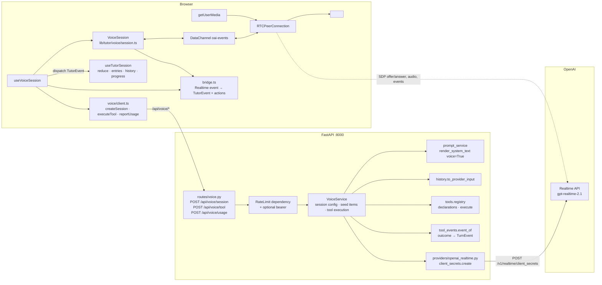
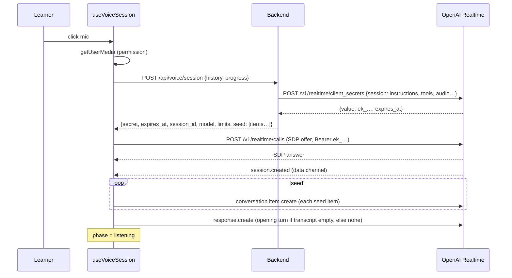
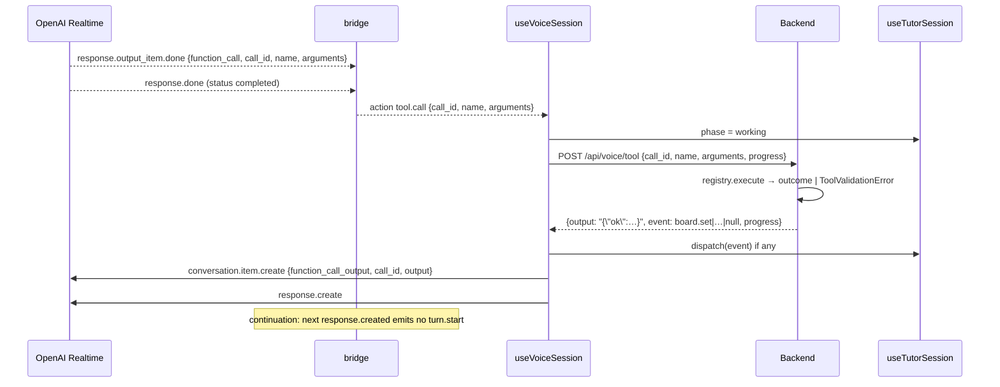

# 003 — Design: talking to Célestin on the OpenAI Realtime API

## 1. Overview

Voice is a second transport for the same tutor. The browser opens a WebRTC call to OpenAI's Realtime API; audio flows browser ↔ OpenAI, JSON events flow over the `oai-events` data channel. The backend never touches audio. It does three things: mint a short-lived client secret whose session configuration carries the rendered tutor prompt and the registry's tool declarations; execute one tool call at a time on behalf of the browser, with the same validation and path rules as the text loop; and receive usage figures for logging.

The frontend turns Realtime server events into the **existing `TutorEvent` vocabulary** (`turn.start`, `text.delta`, `board.set`, `section.start`, …) through a pure bridge, and feeds them into the existing reducer. Nothing downstream of the reducer (transcript, board, strip, map, progress store) learns about voice beyond a `spoken` flag on transcript entries. The `HistoryEntry` shape does not change, so a transcript built in voice mode is valid input to `POST /api/chat`, and switching modes is a matter of which transport the next learner message goes to.

Two Realtime facts shape the design:

- The Realtime model's *tools* and *instructions* are session-level. Where the text loop rebuilds the whole input per turn, voice sets them once at session creation, seeds the prior transcript as conversation items, and injects the path state as a system item.
- A function call ends a Realtime response. The browser sends the tool output and asks for a new response. To keep the reducer's turn semantics (one `turn.start` … `turn.end` around a whole tutor turn including its tool rounds), the bridge treats a response created by our own continuation as the same turn.

Decisions that the requirements left open are in §10.

## 2. Architecture



Runtime topology: unchanged for `/api` (Vite proxy → uvicorn). The browser additionally reaches `https://api.openai.com/v1/realtime/calls` directly, with the ephemeral key. No database, no session store; the only server-held state is the in-memory rate limiter.

### 2.1 Sequence: opening a voice session



### 2.2 Sequence: a tool call



## 3. Components and Interfaces

### 3.1 HTTP API (new, under `/api/voice`)

All three routes accept an optional `Authorization: Bearer <token>` header, read by one dependency (`api/deps.py: VoiceAccess`) that today only applies the rate limit and records whether a bearer was present. When authentication lands, this dependency is where it is verified; the route signatures do not change.

**`POST /api/voice/session`** — mint a client secret and the seed for the conversation.

Request: `VoiceSessionRequest` = `ChatRequest` (`history`, `progress`), same limits.

Response `201`, `Cache-Control: no-store`:

```json
{
  "session_id": "v_9f1c2a",
  "secret": "ek_…",
  "expires_at": 1757600000,
  "model": "gpt-realtime-2.1",
  "voice": "marin",
  "limits": {"max_session_s": 1500, "idle_s": 180},
  "seed": [ {"type": "message", "role": "user", "content": [{"type": "input_text", "text": "…"}]}, … ],
  "opening": true
}
```

- `seed` is the prior transcript mapped to Realtime conversation items plus a final `system` item carrying the state message (§3.4). Empty transcript → `seed` holds the state message only and `opening` is `true`, meaning the browser must request the first response itself.
- `session_id` is server-generated (12 hex chars), logged with the secret creation, and echoed by `/tool` and `/usage` for log correlation only. It is not a credential.
- Errors: `500 prompt_unavailable | pack_unavailable | curriculum_unavailable` (as `/chat`), `502/429/504` provider errors translated as in the Responses adapter, `429 voice_rate_limited` (new) when the per-client budget is spent, `503 voice_disabled` when `voice_enabled` is false.

**`POST /api/voice/tool`** — execute one tool call.

Request:

```json
{"session_id": "v_9f1c2a", "call_id": "call_abc", "name": "start_section", "arguments": "{\"section_id\":\"sa-def\"}", "progress": {"done": [], "active": null}}
```

`arguments` is the raw string the model produced (max `max_message_chars` × 4). `name` max 64 chars. Unknown names are not a 4xx: they go through `registry.execute` and come back as `ok: false`.

Response `200`:

```json
{"output": "{\"ok\":true,\"result\":\"Section « … »…\"}", "event": {"event": "section.start", "section_id": "sa-def", "review": false, "marker": "section commencée · …"}, "progress": {"done": [], "active": "sa-def"}}
```

`output` is exactly the string the text loop would place in `function_call_output` (`registry.output_of` or `{"ok": false, "error": …}`), so the model sees the same thing on both channels. `event` is the `TurnEvent` the text loop would have yielded, serialised with `model_dump(mode="json")` including the `event` discriminator, or `null` for a refusal. `progress` is the normalised progress after the call. HTTP errors only for a malformed request (422) or a missing curriculum (500).

**`POST /api/voice/usage`** — log what a session cost.

Request:

```json
{"session_id": "v_9f1c2a", "reason": "learner|cap|idle|error|unload", "duration_s": 812, "responses": 23,
 "usage": {"input_text": 12480, "input_audio": 5100, "cached_text": 12000, "cached_audio": 4000, "output_text": 900, "output_audio": 9800}}
```

Response `204`. Accepts `Content-Type: text/plain` bodies too, because `navigator.sendBeacon` cannot set JSON headers reliably; the body is parsed as JSON either way. Never fails the caller: a malformed body is logged at `warning` and still answers `204`.

### 3.2 Backend: `VoiceService` (`app/services/voice_service.py`)

```python
class VoiceService:
    def __init__(self, realtime: RealtimeClient, courses: CourseService, settings: Settings): ...

    def session_config(self) -> dict[str, Any]:
        """The Realtime session object: instructions, tools, audio, limits. Pure given
        the course files and settings; byte-stable across calls so the Realtime
        prompt cache hits."""

    def seed(self, entries: list[Entry], progress: ProgressDTO, now: datetime) -> tuple[list[dict], TurnContext]:
        """Prior transcript as Realtime items + trailing system state item."""

    async def create_session(self, entries, progress) -> VoiceSessionResponse:
        """Builds config and seed, mints the secret, returns the DTO. Raises the
        same domain errors as TutorService.build_input before touching the provider."""

    def execute_tool(self, name: str, arguments: str, progress: ProgressDTO) -> VoiceToolResponse:
        """registry.execute in a TurnContext; outcome → (output, event, progress)."""
```

`session_config()`:

```python
{
  "type": "realtime",
  "model": settings.voice_model,
  "instructions": prompt_service.render_system_text(prompt, pack, overview, voice=True),
  "tools": registry.realtime_declarations(),      # §3.3
  "tool_choice": "auto",
  "output_modalities": ["audio"],
  "audio": {
    "input": {
      "noise_reduction": {"type": "near_field"},
      "transcription": {"model": settings.voice_transcription_model, "language": "fr"},
      "turn_detection": {"type": settings.voice_turn_detection, "create_response": True, "interrupt_response": True},
    },
    "output": {"voice": settings.voice_name, "speed": settings.voice_speed},
  },
  "max_output_tokens": settings.voice_max_output_tokens,
  "truncation": "auto",
  "reasoning": {"effort": settings.voice_reasoning_effort},
  "tracing": None,
}
```

No `audio.input.format` / `audio.output.format`: WebRTC negotiates Opus and the fields only apply to WebSocket transports. The `reasoning` key is sent only when `voice_reasoning_effort` is set, because the mini model family may not accept it; the adapter drops it on a 400 mentioning `reasoning` and retries once (logged).

### 3.3 Tool declarations for Realtime (`tools/registry.py`)

Add:

```python
def realtime_declarations() -> list[dict[str, Any]]:
    """Same tools, same order, same name/description/parameters; without `strict`,
    which the Realtime session schema does not define."""
```

Built once like `_DECLARATIONS`. A unit test asserts `[{k: v for k, v in d.items() if k != "strict"} for d in declarations()] == realtime_declarations()` (R2.3), and `test_registry.py` snapshots both against `fixtures/board_declarations.json` (existing) and a new `fixtures/realtime_declarations.json`.

### 3.4 Tool outcome → event (`app/services/tool_events.py`)

The mapping now inlined in `TutorService.run_turn` (the `isinstance` chain over `BoardSet`, `BoardCleared`, `SectionStarted`, `NextStepProposed`, `SectionCompleted`) moves to one pure function:

```python
def event_of(outcome: ToolOutcome) -> TurnEvent: ...
```

`run_turn` calls it and keeps its logging; `VoiceService.execute_tool` calls it too. This is the "one function shared by both loops" of NFR 4.1.2. Golden tests for `/chat` do not change, which proves the refactor.

### 3.5 Prompt: the voice block (`prompt_service.py`, `prompts/tutor.fr.md`)

`tutor.fr.md` gains one block, placed after `## Ta façon de parler`:

```
<!-- VOICE -->
## Quand on se parle à voix haute
- Phrases courtes, une idée par phrase, une question à la fois. Deux ou trois phrases par tour, pas plus, sauf pour une explication qu'elle te demande.
- Tu dis les mathématiques en mots : « u indice n », « q différent de un », « l'intervalle ouvert de moins trois à trois ». Jamais de LaTeX à voix haute.
- Toute formule, tout énoncé, toute correction s'écrit au tableau avec display_board, en même temps que tu le dis.
- Quand tu appelles un outil, annonce-le en une phrase courte avant (« Je l'écris au tableau. »), puis continue après le résultat.
- Si tu n'as pas bien entendu, demande de répéter plutôt que de deviner.
<!-- /VOICE -->
```

`render_system_text(prompt, pack, overview, *, voice: bool = False)` keeps the block for `voice=True` (markers removed) and removes the block *and its markers and the blank line that follows* for `voice=False`. Test: rendering the current prompt with `voice=False` equals the rendering before the block was added, byte for byte (fixture `tests/fixtures/render/system_text_head.txt` covering the part around the block). This keeps the text-mode cached prefix unchanged (NFR 4.2.3) and answers open question 2 of the requirements: the block is voice-only.

### 3.6 Seed items (`VoiceService.seed`)

Reuses `history.to_provider_input(entries, budget, ctx)` (trimming and `replay_output` included) and converts each Responses item to a Realtime conversation item:

| Responses item | Realtime item (`conversation.item.create` payload) |
|---|---|
| `{"role":"user","content":text}` | `{"type":"message","role":"user","content":[{"type":"input_text","text":text}]}` |
| `{"role":"assistant","content":text}` | `{"type":"message","role":"assistant","content":[{"type":"text","text":text}]}` |
| `{"type":"function_call",…}` | unchanged (`call_id`, `name`, `arguments`) |
| `{"type":"function_call_output",…}` | unchanged (`call_id`, `output`) |

Appended last: `{"type":"message","role":"system","content":[{"type":"input_text","text": curriculum_render.state_message(curriculum, progress, now)}]}`.

Budget: `settings.voice_seed_token_budget` (default 12 000, below `history_token_budget` because the Realtime context also carries audio). The seed never exceeds `max_history_entries × 2 + 1` items.

Path-state refresh after a section tool (R2.4): the tool output already carries the brief or the next section; additionally, when the `/tool` response's event is `section.start` or `section.done`, the browser creates one more `system` item with `state_text` returned in the tool response (`VoiceToolResponse.state_text`, present only for section events), *before* the `function_call_output`. The model then has both.

### 3.7 Provider: `providers/openai_realtime.py`

```python
@dataclass(frozen=True)
class ClientSecret:
    value: str
    expires_at: int

class RealtimeClient(Protocol):            # in providers/base.py
    async def create_client_secret(self, *, session: dict[str, Any], ttl_s: int) -> ClientSecret: ...

class OpenAIRealtimeClient:
    def __init__(self, api_key: str, timeout_s: float): ...
    async def create_client_secret(self, *, session, ttl_s):
        res = await self._client.realtime.client_secrets.create(
            expires_after={"anchor": "created_at", "seconds": ttl_s},
            session=session,
        )
        return ClientSecret(value=res.value, expires_at=res.expires_at)
```

Error translation reuses `_translate` (moved to `providers/_errors.py` so both adapters share it). Added to the layering test's allow-list. Wired in `create_app` as `app.state.realtime`; `deps.get_realtime` mirrors `get_llm`. Tests use `tests/fixtures/fake_realtime.py: FakeRealtime` recording the `session` it was handed and returning a fixed secret, or raising.

The SDK method name is verified at implementation time against `openai>=3.12` (`client.realtime.client_secrets.create`); if it differs, the adapter is the only file that changes.

### 3.8 Rate limit dependency (`api/ratelimit.py`)

In-memory sliding window keyed by client IP (`request.client.host`, or `X-Forwarded-For` first hop when `settings.trust_proxy` is true): at most `voice_sessions_per_hour` calls to `/session` per key. Refusal is `429 voice_rate_limited` with a French message. `/tool` and `/usage` are not limited beyond the body-size middleware: they cannot spend money without a live session. The limiter is process-local by design (single process, single learner); documented as such.

### 3.9 Frontend: types (`lib/tutor/types.ts`)

```ts
export type TranscriptEntry =
  | { id: string; role: "learner"; text: string; spoken?: true }
  | { id: string; role: "tutor"; text: string; blockId: number; interrupted?: boolean; spoken?: true }
  | …unchanged
```

`HistoryEntry` unchanged (the backend forbids extra fields). New file `lib/tutor/voice/types.ts`:

```ts
export type VoicePhase = "off" | "connecting" | "listening" | "speaking" | "working" | "error";
export type VoiceEndReason = "learner" | "cap" | "idle" | "error" | "unload";
export type VoiceSessionInfo = { sessionId: string; secret: string; expiresAt: number; model: string; voice: string;
  limits: { maxSessionS: number; idleS: number }; seed: RealtimeItem[]; opening: boolean };
export type ToolCall = { callId: string; name: string; arguments: string };
export type ToolResult = { output: string; event: TutorEvent | null; progress: Progress; stateText?: string };
export type VoiceUsage = Record<"input_text"|"input_audio"|"cached_text"|"cached_audio"|"output_text"|"output_audio", number>;
```

`lib/tutor/voice/realtime.ts` declares the subset of Realtime server/client events the bridge reads, as discriminated unions on `type` (`session.created`, `input_audio_buffer.speech_started`, `conversation.item.input_audio_transcription.completed`, `response.created`, `response.output_item.added`, `response.output_audio_transcript.delta`, `response.output_item.done`, `response.done`, `output_audio_buffer.stopped`, `error`). Unknown types are ignored.

### 3.10 Frontend: `VoiceSession` (`lib/tutor/voice/session.ts`)

Owns the WebRTC objects. No React, no reducer knowledge.

```ts
export type VoiceSessionDeps = {
  createPeer: () => RTCPeerConnection;          // injectable for tests
  getMic: () => Promise<MediaStream>;
  audioEl: HTMLAudioElement;
  fetchSdp: (offerSdp: string, secret: string) => Promise<string>;
};

export class VoiceSession {
  constructor(deps: VoiceSessionDeps, onEvent: (e: RealtimeServerEvent) => void, onClose: (reason: "remote"|"local"|"failed") => void)
  async connect(secret: string): Promise<void>   // getMic → addTrack → createDataChannel("oai-events") → offer → fetchSdp → setRemoteDescription → wait channel open
  send(event: RealtimeClientEvent): void         // JSON over the channel; throws if closed
  setMuted(muted: boolean): void                 // track.enabled
  close(): void                                  // stop tracks, close channel + peer, idempotent
}
```

`fetchSdp` default: `POST https://api.openai.com/v1/realtime/calls`, headers `Authorization: Bearer <secret>`, `Content-Type: application/sdp`, body the offer SDP; response body is the answer SDP. Remote track → `audioEl.srcObject`, `autoplay`. ICE failure or channel close → `onClose("failed" | "remote")`.

### 3.11 Frontend: the bridge (`lib/tutor/voice/bridge.ts`)

Pure function over an explicit state, so it is tested against recorded event fixtures like `sse.ts`.

```ts
export type BridgeState = {
  inTurn: boolean;           // a turn.start has been emitted and no turn.end yet
  continuing: boolean;       // we sent response.create after a tool output
  blockId: number;           // per-turn counter, +1 per tool round (matches the text loop)
  items: Record<string, { kind: "audio" | "function_call"; name?: string; callId?: string }>;
  pendingCalls: ToolCall[];  // collected during a response, emitted at response.done
};
export type BridgeAction =
  | { kind: "tool.call"; call: ToolCall }
  | { kind: "learner.spoken"; text: string }
  | { kind: "usage"; usage: VoiceUsage }
  | { kind: "interrupted" }
  | { kind: "speaking"; on: boolean }
  | { kind: "error"; message: string };
export function bridge(state: BridgeState, ev: RealtimeServerEvent): { state: BridgeState; events: TutorEvent[]; actions: BridgeAction[] };
```

Mapping:

| Realtime server event | Emits |
|---|---|
| `response.created` | `turn.start {turn_id: response.id}` unless `continuing`; `continuing = false` |
| `response.output_item.added` (audio message) | remembers item id → block |
| `response.output_audio_transcript.delta` | `text.delta {block_id, text}` |
| `response.output_item.done` (function_call) | queues `{callId, name, arguments}` |
| `response.done` | `usage` action from `response.usage`; if pending calls: `blockId += 1`, `tool.call` action per call (in order), no `turn.end`; else `turn.end {reason: status === "cancelled" ? "cancelled" : "end"}` and `inTurn = false`; status `failed`/`incomplete` with an error → `error` event with the French generic message plus `turn.end` |
| `conversation.item.input_audio_transcription.completed` | `learner.spoken {text}` |
| `input_audio_buffer.speech_started` while `inTurn` | `interrupted` action |
| `output_audio_buffer.stopped` / `.started` | `speaking {on}` action |
| `error` | `error` action (message logged; French generic shown) |

`text.delta` block ids restart at 0 on each non-continuation `turn.start`, exactly like the text loop, so the reducer's `blocks` map behaves identically.

### 3.12 Frontend: `useVoiceSession` (`components/celestin/use-voice-session.ts`)

```ts
export function useVoiceSession(tutor: TutorSessionHandle, opts: { enabled: boolean }): {
  phase: VoicePhase; muted: boolean; remainingS: number | null; error: string | null;
  start(): Promise<void>; stop(): void; toggleMute(): void; sendText(text: string): void;
}
```

`TutorSessionHandle` is what `useTutorSession` now also returns (§3.13): `{ dispatch(event: TutorEvent), appendLearner(text, spoken?), markInterrupted(), snapshot(): {history, progress} }`.

Responsibilities:

1. **start**: `phase = connecting`; `getUserMedia` first (permission prompt before spending a secret); `POST /api/voice/session` with `snapshot()`; `VoiceSession.connect(secret)`; on `session.created`, send every seed item as `conversation.item.create`, then `response.create` if `opening`; `phase = listening`; start the cap and idle timers.
2. **event loop**: every server event → `bridge` → `tutor.dispatch(events…)`, then actions:
   - `tool.call` → `phase = working`; calls are executed **serially in order** through a promise queue: `POST /api/voice/tool` with `tutor.snapshot().progress`; on success `tutor.dispatch(event)` if any, send `system` state item if `stateText`, send `function_call_output`, and after the last call of the batch send `response.create`; `phase = speaking`.
   - `learner.spoken` → `tutor.appendLearner(text, true)`; resets the idle timer.
   - `interrupted` → `tutor.markInterrupted()`; resets the idle timer.
   - `speaking` → `phase = speaking | listening`.
   - `usage` → accumulates into the session total; `responses += 1`.
   - `error` → transcript error entry via `dispatch({event:"error"…})`; the session stays up unless the channel closes.
3. **sendText(text)**: `tutor.appendLearner(text)` (not spoken), `conversation.item.create` user `input_text`, `response.create`. Used by the composer and by the board's `onAnswer` / `onNextStep` while voice is active.
4. **stop(reason)**: `VoiceSession.close()`, clear timers, `POST /api/voice/usage` (or `sendBeacon` on `pagehide`), dispatch a marker entry (`Fin de la séance vocale` + reason text), `phase = off`. Idempotent.
5. **Timers**: cap timer from `limits.maxSessionS`, exposed as `remainingS` for the header countdown; at zero, wait for the current response's `turn.end` (max 10 s) then `stop("cap")`. Idle timer from `limits.idleS`, reset on `speech_started`, `learner.spoken`, `sendText`, and `response.created`; at zero `stop("idle")`.
6. **Single session guard**: a `BroadcastChannel("celestin.voice")` announces `start`; a second tab that hears a `start` while starting refuses with the R7.6 message. Same-tab double start is a no-op.
7. **Teardown** on unmount: `stop("unload")`.

Tool calls are always executed against the browser's latest progress: because tool execution is serial and `dispatch` is synchronous, a `start_section` followed by `display_board` in the same response sees the updated `active`.

### 3.13 Frontend: `useTutorSession` changes

- Returns `dispatch(event)` (= `push` + `flush` for non-delta), `appendLearner(text, spoken?)`, `markInterrupted()`, `snapshot()`, in addition to today's API.
- `send(text)` refuses while a voice session is active? No: the route decides. `Lesson` composes `const onSend = voice.phase !== "off" ? voice.sendText : session.send` and passes it to both `TutorColumn` and the board callbacks. `useTutorSession` is unchanged in behaviour; `abortRef` guards HTTP turns only.
- `reduce` unchanged except `appendLearner` accepting `spoken` and the `text.delta` case stamping `spoken: true` on new tutor entries when `state.voice` is true. Simplest: a `voice: boolean` field on `SessionState` toggled by two new internal events `voice.on` / `voice.off` handled in `reduce` (they also append the start/end markers). These two events are **client-internal** and not part of the SSE contract; they live in a `LocalEvent` union alongside `TutorEvent` in the reducer's input type.
- `retry` in voice mode: not offered. A failed voice turn ends with a `turn.end`; the learner just speaks again. The "Réessayer" button is hidden while `voice.phase !== "off"`.

### 3.14 Frontend: `TutorColumn`

- Mic button: `onClick` → `start`/`stop`; icon `Mic` / `MicOff` (muted) / `PhoneOff`? No: one toggle for start/stop, one small mute toggle next to it visible only while active. Titles: « Parler à Célestin », « Terminer la séance vocale », « Couper le micro » / « Réactiver le micro ».
- Header status label extends `SessionStatus`: `phase` drives the dot and text: « Célestin t'écoute », « Célestin parle », « Célestin écrit au tableau », « Micro coupé », « Connexion… ». Countdown `mm:ss` next to it while active.
- Unsupported browser (`!navigator.mediaDevices?.getUserMedia || !window.RTCPeerConnection`): the button keeps `title="Parler (bientôt)"` and stays inert.
- Transcript entries with `spoken` render a small `AudioLines` icon before the text with `aria-label="dit à voix haute"`.
- Textarea stays enabled during voice (R4.3); placeholder « Écris ou parle à Célestin… ».
- `aria-live` status extends to voice phases.

### 3.15 Configuration (`config.py`)

| Key | Default | Purpose |
|---|---|---|
| `voice_enabled` | `true` | 503 on `/session` when false; the mic stays inert (frontend reads `/api/health` → `voice: bool`) |
| `voice_model` | `gpt-realtime-2.1` | R6.5 |
| `voice_name` | `marin` | |
| `voice_speed` | `1.0` | 0.25–1.5 |
| `voice_reasoning_effort` | `low` | empty string = omit |
| `voice_transcription_model` | `gpt-4o-mini-transcribe` | verify against the deprecation notice at implementation; any model the session schema lists works |
| `voice_turn_detection` | `semantic_vad` | or `server_vad` |
| `voice_max_output_tokens` | `1024` | one spoken turn |
| `voice_secret_ttl_s` | `90` | R5.2 |
| `voice_session_max_s` | `1500` | R6.1 |
| `voice_idle_s` | `180` | R6.2 |
| `voice_sessions_per_hour` | `6` | R5.5 |
| `voice_seed_token_budget` | `12000` | §3.6 |
| `trust_proxy` | `false` | rate-limit key |

`/api/health` gains `"voice": settings.voice_enabled` and `"voice_model"`.

## 4. Data Models

### 4.1 Wire DTOs (`app/api/schemas/voice.py`)

```python
class VoiceSessionRequest(ChatRequest): ...

class VoiceLimits(_Model):
    max_session_s: int
    idle_s: int

class VoiceSessionResponse(_Model):
    session_id: str
    secret: str
    expires_at: int
    model: str
    voice: str
    limits: VoiceLimits
    seed: list[dict[str, Any]]
    opening: bool

class VoiceToolRequest(_Model):
    session_id: Annotated[str, Field(max_length=32)]
    call_id: Annotated[str, Field(min_length=1, max_length=128)]
    name: Annotated[str, Field(min_length=1, max_length=64)]
    arguments: Annotated[str, Field(max_length=16_000)]
    progress: ProgressDTO = ProgressDTO()

class VoiceToolResponse(_Model):
    output: str
    event: dict[str, Any] | None      # TurnEvent.model_dump(mode="json"), discriminator included
    progress: ProgressDTO
    state_text: str | None = None

class VoiceUsageTotals(_Model):
    input_text: int = 0; input_audio: int = 0; cached_text: int = 0; cached_audio: int = 0
    output_text: int = 0; output_audio: int = 0

class VoiceUsageReport(_Model):
    session_id: Annotated[str, Field(max_length=32)]
    reason: Literal["learner", "cap", "idle", "error", "unload"]
    duration_s: Annotated[int, Field(ge=0, le=7200)]
    responses: Annotated[int, Field(ge=0, le=10_000)]
    usage: VoiceUsageTotals
```

`extra="forbid"` throughout, like `chat.py`.

### 4.2 Provider models (`providers/base.py`)

`ClientSecret(value, expires_at)` and the `RealtimeClient` protocol (§3.7).

### 4.3 Domain errors (`domain/errors.py`)

```python
class VoiceRateLimited(TutorError):  code = "voice_rate_limited"; status = 429
    message_fr = "Trop de séances vocales d'un coup. Réessaie dans un moment, ou écris à Célestin."
class VoiceDisabled(TutorError):     code = "voice_disabled"; status = 503
    message_fr = "La voix n'est pas activée sur cette installation."
```

### 4.4 Frontend state

`SessionState` gains `voice: boolean`. `TranscriptEntry` learner/tutor gain `spoken?: true`. `useVoiceSession` holds `{phase, muted, remainingS, error}` in React state and `{session, bridgeState, usage, timers, queue}` in refs.

### 4.5 Usage accounting (frontend)

From each `response.done`: `usage.input_token_details.{text_tokens, audio_tokens, cached_tokens_details.{text_tokens, audio_tokens}}` and `usage.output_token_details.{text_tokens, audio_tokens}` summed into `VoiceUsage`. Missing fields count as 0. Input transcription usage (`conversation.item.input_audio_transcription.completed.usage`) is added to `input_audio` when present.

## 5. Error Handling

| Where | Failure | Behaviour |
|---|---|---|
| `start` | `getUserMedia` rejected | `phase = off`, transcript error entry « Célestin n'a pas accès à ton micro. Autorise-le dans ton navigateur, puis réessaie. » No secret minted. |
| `start` | `/session` non-2xx | error entry with the server's French message (`readError` from `client.ts` reused), `phase = off`. 429 → the rate-limit message. |
| `start` | SDP fetch non-2xx, ICE failed, channel never opens (10 s) | error entry « La connexion vocale n'a pas abouti. Réessaie, ou écris à Célestin. », `close()`, `phase = off`, usage reported with `reason: error`. |
| `start` | secret expired before SDP (`401`) | same as above; the next start mints a new one. |
| live | channel `close` / peer `disconnected`→`failed` | `stop("error")` with marker « Connexion vocale perdue. »; completed turns stay; a tool call whose `/tool` response arrived is applied and its history entry kept; one whose response did not arrive is dropped along with nothing else (the model never got its output; the transcript holds no half entry because tool history entries are only written by `dispatch(event)`). |
| live | Realtime `error` event | logged; error entry only if `error.type` is not `invalid_request_error` for a `conversation.item.truncate`-class nuisance; the session stays up. |
| live | `response.done` status `failed` | error entry + `turn.end`; session stays up. |
| tool | `/tool` 5xx or network | send `function_call_output` with `{"ok":false,"error":"Outil indisponible. Dis-le à l'élève et continue sans."}`, then `response.create`; error entry in the transcript. |
| tool | refusal (`ok: false`) | output forwarded verbatim, no event, no entry (as text mode). |
| tool | tab's progress differs from what the model assumed | not an error: the backend decides from the posted progress; a refusal comes back as `ok: false`. |
| backend `/session` | prompt/pack/curriculum unavailable | same `TutorError` subclasses and statuses as `/chat`. |
| backend `/session` | provider errors | translated by the shared `_translate`; 502/429/504. |
| backend `/tool` | curriculum unavailable | 500 `curriculum_unavailable`. Malformed body → 422 (a bug, not a runtime condition). |
| backend `/usage` | anything | 204, `warning` log. |
| timers | cap / idle | graceful stop with marker « Fin de la séance vocale : temps écoulé. » / « … : silence prolongé. » |
| second tab | `BroadcastChannel` says busy | error entry « Une séance vocale est déjà ouverte dans un autre onglet. » |

The text mode's `retry` rollback is not used in voice; a voice turn that fails leaves what was heard and ends.

## 6. Testing Strategy

Backend (offline, `pytest`):

- `test_registry.py`: `realtime_declarations()` equals `declarations()` minus `strict`; snapshot `fixtures/realtime_declarations.json`.
- `test_prompt_service.py`: voice block kept/removed; `voice=False` rendering byte-equal to the pre-change fixture; missing `<!-- /VOICE -->` raises `PromptUnavailable`.
- `test_tool_events.py`: `event_of` for each outcome; `test_tutor_service.py` and the `/chat` golden tests unchanged and passing after the refactor.
- `test_voice_service.py`: `session_config()` byte-stable across two calls and containing instructions with the pack; `seed()` mapping table (§3.6) including the trailing system item and the trimming; `execute_tool` returns `(output, event, progress)` identical to what `run_turn` yields for the same call (parametrised over the five tools and a refusal).
- `test_voice_endpoint.py` (integration, `FakeRealtime`): `/session` 201 shape, `no-store` header, secret never logged (caplog); 429 after `voice_sessions_per_hour`; 503 when disabled; `/tool` golden: `start_section` → `section.start` event and `active` set; refusal → `event: null`, `output` with `ok: false`, 200; unknown tool → 200 `ok: false`; `/usage` 204 on valid, malformed and `text/plain` bodies.
- `test_layering.py`: allow-list extended to `openai_realtime.py`; the import guard still holds elsewhere.
- `test_openai_realtime_adapter.py`: SDK call shape with a stubbed client; error translation; the `reasoning` retry.
- `scripts/voice_smoke.py` (real API, not in pytest): mints a secret, prints model and expiry, exits non-zero on failure. No audio.

Frontend (`vitest`):

- `voice/__tests__/bridge.test.ts`: fixture JSONL files recorded from a real session (`fixtures/realtime/*.jsonl`): plain spoken turn → `turn.start`, deltas with `block_id 0`, `turn.end`; tool round → no extra `turn.start`, `block_id` increments, `tool.call` actions in order; cancelled response → `turn.end cancelled` + `interrupted`; usage sums.
- `voice/__tests__/session.test.ts`: `VoiceSession` against a fake `RTCPeerConnection`/data channel: connect sequence, `send` after close throws, `close` idempotent and stops tracks.
- `voice/__tests__/client.test.ts`: request shapes, `readError` reuse, `sendBeacon` fallback.
- `__tests__/use-voice-session.test.ts` (jsdom): start → seed sent → `opening` triggers `response.create`; tool call → `/tool` mocked → `dispatch` called with the event → `function_call_output` then `response.create` sent; serial execution of two calls; cap timer → stop with marker; idle timer; mic denied path; second-tab refusal.
- `__tests__/use-tutor-session.test.ts`: `appendLearner(text, true)` flags `spoken`; `voice.on/off` markers; `text.delta` under `voice` flags `spoken`.
- `__tests__/tutor-column.test.tsx`: mic states and labels; inert when unsupported; textarea enabled in voice.

Manual checklist (documented in `documentation/voice.md`): open on empty transcript (Célestin opens), open on existing transcript (Célestin continues), board card appears while Célestin talks about it, section start/complete by voice reflected on the strip, barge-in, type during voice, mute, cap countdown, mode switch both ways, reload.

## 7. Performance Considerations

- Start latency: `getUserMedia` and `/session` run sequentially (permission first, by design); `/session` is one Responses-free call to OpenAI (~300 ms) plus the SDP exchange (~500 ms). Target under 3 s (NFR 4.2.1).
- Seed: up to a few hundred `conversation.item.create` messages over the data channel before the first response; sent back-to-back without awaiting acks (the channel is ordered and reliable). For the typical session (< 60 entries) this is under 100 ms.
- The text pipeline's cached prefix is untouched (§3.5 test). The voice instructions + tools are byte-stable across sessions (config built from the same cached files), so the Realtime prompt cache applies to the ~12 k-token prefix.
- `max_output_tokens` 1024 bounds a spoken turn; `truncation: "auto"` bounds the context.
- Tool round trip: one local HTTP call; `/tool` does no I/O beyond reading the cached curriculum. The reducer applies the event before the model starts the next response, so the card is on the board before Célestin says "voilà".

## 8. Security Considerations

- `OPENAI_API_KEY` is used only in `providers/`; the browser receives an `ek_` secret with `voice_secret_ttl_s` lifetime, once per session, never logged (the response is logged without `secret`).
- The two money-spending routes share the `VoiceAccess` dependency: rate limit now, bearer verification later, one place.
- Tool arguments from the model are parsed and validated by the registry exactly as in text mode; the browser cannot inject a tool *result*, only forward a call. The backend never trusts `session_id` for anything but log correlation.
- The Realtime session echoes the instructions (prompt + pack) over the data channel in `session.created`; accepted per requirement 4.3.4. The `/session` response itself does not include them.
- No audio is stored by the product; `tracing: null`. `documentation/voice.md` states OpenAI's retention terms apply.
- `BodySizeLimitMiddleware` and `RequestIdMiddleware` cover the new routes. CORS (when enabled) allows `authorization` in `allow_headers` for the future bearer.
- The browser talks to `api.openai.com` directly; no CSP is in place today, nothing to change.

## 9. Monitoring and Observability

Structured logs (existing `logging_config`):

| Event | Fields |
|---|---|
| `voice_session_created` | `session_id`, `model`, `voice`, `ttl_s`, `seed_items`, `history_entries`, `bearer_present`, `client_key` (hashed IP) |
| `voice_session_refused` | `reason` (`rate_limited`, `disabled`, provider code) |
| `voice_tool` | `session_id`, `name`, `ok`, `event`, `section_active`, `ms` |
| `voice_usage` | `session_id`, `reason`, `duration_s`, `responses`, the six token totals, and `cost_estimate_usd` computed from `voice_price_*` settings (defaults from the published list: audio in 32 / cached 0.40 / out 64; text in 4 / cached 0.40 / out 24 per million) |

Browser: `console.info` of the same `voice_usage` payload at session end in development builds. The `/api/health` payload reports `voice` and `voice_model`.

## 10. Decisions

1. **Ephemeral client secret, browser-side SDP exchange** (R5.1), rather than proxying the SDP through the backend to `POST /v1/realtime/calls` with the API key. The proxy variant would keep the prompt out of the browser and give the backend a `call_id` for server-side hang-up, but it makes the backend a party to every call and departs from the reviewed requirement. Recorded as the first thing to revisit if the session echo of instructions or the client-side cap prove unsatisfactory.
2. **Tool calls bridged from the browser** (requirement 4.1.7 option A). The server-attached-call alternative could not be verified in the current API reference (the calls endpoints document accept/reject/hangup/refer for SIP and no WebSocket attach), so it is out.
3. **Raw `RTCPeerConnection`, no `@openai/agents` dependency.** The bridge is ~150 lines, fully testable with fakes, and keeps the package release-age rule and the build out of the picture. The Agents SDK would also run tools in the browser, which is exactly what this design avoids.
4. **Voice block is voice-only** in the prompt (R2.2), because the text prefix must not move (NFR 4.2.3).
5. **Turn semantics preserved through continuation.** A Realtime response created by our `function_call_output` + `response.create` is the same tutor turn; the bridge suppresses `turn.start` and increments `block_id`, so `nextStep` survives a `propose_next_step` exactly as in text mode.
6. **Interruption keeps the transcript received so far** and marks the entry interrupted, rather than trimming to the audio actually heard (R4.4 wording). Computing `audio_end_ms` from playback position is possible but not worth it for an exploration; the server truncates its own item on WebRTC.
7. **Seed built server-side** because replayed `start_section` outputs need the curriculum brief, which never crosses the wire, and because it reuses `history.to_provider_input` unchanged.
8. **Path-state refresh** after section tools as an extra system item (R2.4), sent by the browser from `state_text` in the tool response, before the tool output.
9. **No `retry` in voice mode**; speaking again is the retry.
10. **Rate limit is process-local**, keyed by IP. Good enough for one learner on one box; the dependency is the seam for real auth.
