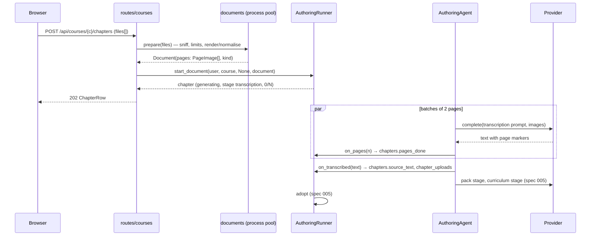

# 006 — Design: document upload

## 1. Overview

A chapter is added by uploading one PDF or 1–N images. The route checks and renders the document into page images (in a worker process, before any model call), then hands them to the spec 005 `AuthoringRunner`. A new first stage of `AuthoringAgent.run`, **transcription**, sends the pages in parallel batches to a vision model and joins the answers into one Markdown text with `--- page N ---` markers, handwriting and doubt marked. The transcription is written to the chapter's `source_text` as soon as it validates; the pack and curriculum stages of spec 005 then run on it unchanged, with an authoring prompt that knows the markers.

Nothing new is stored but text and counters: page images live in memory for the run only. A failed pack or curriculum stage is retried from the stored transcription; a failed transcription needs the document again.

Unchanged: the lesson, the tools, the prompt layers, adoption, progress, editors (pack and path), the provider seam (`complete()` already carries arbitrary content parts), limits and quotas of spec 005.

Removed: the paste form and the JSON `POST /courses/{id}/chapters {source_text}` route. Kept: `PUT …/source {source_text}` — it now edits the transcription and re-prepares from the pack stage.

## 2. Architecture

```mermaid
flowchart LR
    subgraph Browser
        PICK[DocumentPicker<br/>PDF or images, order, remove]
        ROW[chapter row<br/>« Lecture des pages… (n/N) »]
    end
    subgraph Backend
        LIM[BodyLimit ASGI middleware<br/>streamed byte cap per route]
        UP[routes/courses.py<br/>POST …/chapters (multipart)<br/>PUT …/document (multipart)]
        DOC[services/documents.py<br/>sniff · open · render · normalise<br/>ProcessPool, timeout]
        RUN[AuthoringRunner<br/>start_document(...)]
        AG[AuthoringAgent<br/>0. transcription → 1. pack → 2. curriculum]
        PROV[providers/openai_responses.complete<br/>input_image parts]
        DB[(chapters · authoring_runs · chapter_uploads)]
    end
    PICK -->|multipart| LIM --> UP --> DOC -->|PageImage list| RUN --> AG --> PROV
    AG -->|pages done, transcription| RUN --> DB
    ROW -->|GET /courses/{id} every 3 s| UP
```

### 2.1 Sequence: new chapter from photos



## 3. Components and Interfaces

### 3.1 HTTP API

| Route | Request | Response |
|---|---|---|
| `POST /courses/{course_id}/chapters` | `multipart/form-data`, field `files` (1 PDF, or 1–N images in page order) | `202 ChapterRow`; `413 document_too_large`; `422 document_invalid` / `too_many_pages`; spec 005 `409 chapter_limit`, `429 authoring_busy` / `authoring_quota` |
| `PUT /courses/{course_id}/chapters/{chapter_id}/document` | same multipart | `202 ChapterRow`; same errors; `409 authoring_running` |
| `PUT …/chapters/{chapter_id}/source` | `{source_text}` (unchanged) | `202`; now re-prepares from the pack stage (no transcription) |
| `POST …/chapters/{chapter_id}/retry` | — | `202`; `409 document_needed` when the last run failed before a transcription was stored |
| `GET /subjects` | — | `limits` gains `document_max_bytes`, `document_max_pages`, `document_min_pixels`, `document_types` |

The JSON `POST …/chapters {source_text}` route is removed.

### 3.2 Body limit (`app/api/middleware.py`)

`BodySizeLimitMiddleware` (BaseHTTPMiddleware, `Content-Length` only) is replaced by a pure ASGI `BodyLimitMiddleware`:

- limit per request: `document_max_bytes + 64 KiB` for the two multipart routes (path match), `max_body_bytes` otherwise;
- refuses up front on a declared `Content-Length` above the limit; otherwise wraps `receive` and counts bytes, answering `413 payload_too_large` (JSON, French) as soon as the count passes the limit, chunked bodies included.

This also closes the `Content-Length`-only gap left open in spec 005.

### 3.3 Documents (`app/services/documents.py`)

Pure functions over bytes, run in a `concurrent.futures.ProcessPoolExecutor(max_workers=settings.document_workers)` (default 2) with `document_render_timeout_s` (default 60): a malicious or huge PDF cannot block the event loop or crash the server process.

```python
Kind = Literal["pdf", "images"]

@dataclass(frozen=True)
class PageImage:
    number: int            # 1-based, global within the chapter
    jpeg: bytes            # longest side ≤ transcription_max_side_px, colour, quality 80
    text_hint: str | None  # PDF text layer when ≥ 200 non-space characters, else None

@dataclass(frozen=True)
class Document:
    kind: Kind
    pages: list[PageImage]
    bytes_in: int

def sniff(head: bytes) -> Literal["pdf", "jpeg", "png", "webp"] | None   # magic bytes only
def prepare(files: list[tuple[str, bytes]], limits: DocumentLimits, first_page: int = 1) -> Document
```

`prepare` rules (each failure raises `DocumentInvalid(reason)` with a French message, mapped to 422 by the route):

1. At least one file. Either exactly one PDF, or only images (no mix, no second PDF).
2. Each file's type from `sniff`, not from its name or declared content type.
3. PDF: open with `pypdfium2` (password → « PDF protégé par un mot de passe »; parse error → « PDF illisible »); page count ≤ `document_max_pages` (else `TooManyPages`); render each page at `transcription_dpi` (default 150) to RGB, downscale to `transcription_max_side_px` (default 1800), JPEG q80; text layer via `get_textpage().get_text_range()`.
4. Images: Pillow with `Image.MAX_IMAGE_PIXELS = 40_000_000` (decompression bomb guard), `ImageOps.exif_transpose`, shorter side ≥ `document_min_pixels` (else « Photo trop petite (page n) »), RGB, same downscale and JPEG; total images ≤ `document_max_pages`.
5. Zero pages → « Document vide ».

`pypdfium2` (Apache-2.0/BSD) and `Pillow` become backend dependencies, with `python-multipart` for FastAPI's `UploadFile`.

### 3.4 Routes (`app/api/routes/courses.py`)

```python
@router.post("/courses/{course_id}/chapters", status_code=202)
async def add_chapter(course_id, files: list[UploadFile], user, repos, settings, authoring, documents) -> ChapterRow
@router.put("/courses/{course_id}/chapters/{chapter_id}/document", status_code=202)
async def replace_document(course_id, chapter_id, files: list[UploadFile], ...) -> ChapterRow
```

Both: ownership first (404 before reading the body is not possible with multipart; the body cap bounds the cost), read each `UploadFile` fully (already capped), `await documents.prepare(...)` in the pool, close the uploads, then `authoring.start_document(...)`. For `replace_document`, `first_page` is 1 (the document replaces the source). Filenames are never logged or stored.

`documents` is a `DocumentService` on `app.state` owning the process pool (shut down in the lifespan).

### 3.5 Runner (`app/services/authoring/runner.py`)

```python
async def start_document(self, user, course, chapter: ChapterRecord | None, document: Document) -> ChapterRecord
async def start_new_chapter(...)            # removed (text path had only one caller)
async def start_source_edit(user, owned, source_text)   # unchanged: runs pack → curriculum
async def start_retry(user, owned)          # runs pack → curriculum on the stored source;
                                            # DocumentNeeded when owned.chapter.source_text is empty
                                            # or its last failure was at stage "transcription"
```

`start_document` = spec 005 `_start` with `source_kind="document"`, `page_count=len(pages)`, chapter `source_text` left as is (empty for a new chapter), `authoring_stage="transcription"`, `pages_done=0`, `page_count=N`. The task runs `agent.run(..., document=document, on_pages=…, on_transcribed=…)`.

Callbacks (sync, called via `asyncio.to_thread` by the agent):

- `on_pages(done)` → `chapters.set_progress(chapter_id, stage="transcription", pages_done=done)` (one small UPDATE per batch).
- `on_transcribed(text, markers)` → one transaction: `chapters.source_text = text`, `source_kind = "document"`, `authoring_stage = "pack"`; replace the chapter's `chapter_uploads` rows with one row `{run_id, first_page: 1, page_count: N}`; run row gets the transcription counters. From here a failure keeps this source (R3.3).

Stage transitions `pack` → `curriculum` are written the same way (`set_progress(stage=…)`), so the row can say « En préparation… » and a failure knows its stage.

`DocumentNeeded` (409 `document_needed`): « Dépose à nouveau le document : il n'est pas conservé. »

### 3.6 Agent (`app/services/authoring/agent.py`)

```python
async def run(self, *, chapter_id, subject, source_text: str | None = None, document: Document | None = None,
              usage, log_extra, on_pages=None, on_transcribed=None) -> AuthoringOutput
```

Exactly one of `source_text`, `document`. With a document: `text = await self._transcription_stage(document, usage, extra, on_pages)`, then `on_transcribed(text, counts)`, then the spec 005 stages on `text`.

**Transcription stage.**

- Batches of `transcription_batch_pages` (default 2) consecutive pages; at most `transcription_concurrency` (default 4) batches in flight (`asyncio.Semaphore` local to the run).
- One `complete()` call per batch: `model=transcription_model`, `reasoning_effort=transcription_reasoning_effort` (default `low`), `max_output_tokens=transcription_max_output_tokens` (default 16 000), no schema. Instructions: `prompts/transcription/transcribe.fr.md` (static, cached). Input: one user message with, per page, `input_text` « Page N : » (+ « Couche texte du PDF, indice non fiable : … » when `text_hint`), then `input_image` (`data:image/jpeg;base64,…`, `detail=transcription_detail`, default `high`).
- **Batch validation** (`validate_batch(text, numbers) -> list[ContentIssue]`): the markers `--- page N ---` are exactly the batch's numbers, in order, each once; every page body is non-empty or `[page vide]`. A batch with issues, or `ProviderOutputTruncated`, is retried once alone; a truncated two-page batch is retried as two single-page calls. Second failure → `AuthoringFailed("transcription_failed", "transcription", …)`. Provider errors → `provider` as in spec 005.
- **Handwriting check** (R2.3), behind `transcription_verify_handwriting` (default decided by the eval, §6): for each page whose transcription has `[manuscrit` lines containing digits, one extra call with the page image and the numbered list of those readings, asking for each « sûr » or « incertain: lecture1 | lecture2 »; readings answered uncertain are rewritten `[incertain: …]` in place. Results merge deterministically (line index + original string match).
- Batches complete out of order; the text is joined in page order. `on_pages` is called with the cumulative count after each validated batch.
- Counts for the run: `[manuscrit`, `[incertain`, `[illisible]` occurrences.

`AuthoringFailed.code` gains `transcription_failed`; `Stage` gains `transcription`. `RunUsage` gains `attempts_transcription`, `transcription_ms`, `transcription_cost_usd` (tokens of this stage priced with the transcription model's prices).

### 3.7 Prompts

- `prompts/transcription/transcribe.fr.md`: the trial prompt (`scripts/transcribe_trial.py`), strengthened on doubt: « Un chiffre, un signe ou un nombre manuscrit que tu pourrais lire de deux façons s'écrit `[incertain: a | b]`. En cas de doute, marque le doute : une lecture fausse présentée comme sûre est la pire erreur possible. », with two examples (3/5, 1/7). Checked at startup by `PromptLibrary` (required file).
- `prompts/transcription/verify.fr.md`: the handwriting check prompt (required only when the setting is on).
- `prompts/authoring/pack.fr.md` gains a section « Si le matériel est une transcription de pages » : texte tapé = le cours, fait foi ; `[manuscrit]` = compléments et corrigés, vérifiés comme tout corrigé ; `[incertain]` / `[illisible]` jamais enseignés comme sûrs, toujours dans « Points à vérifier » ; chaque point cite sa page (« p. 5 ») ; `[figure : …]` décrit sans inventer de valeurs ; `[barré]` ignoré sauf s'il éclaire une correction.

### 3.8 Settings (`config.py`, `.env.example`)

| Key | Default |
|---|---|
| `document_max_bytes` | `26_214_400` (25 MiB) |
| `document_max_pages` | `50` |
| `document_min_pixels` | `800` |
| `document_workers` / `document_render_timeout_s` | `2` / `60` |
| `transcription_model` | `gpt-5.6-terra` |
| `transcription_reasoning_effort` | `low` |
| `transcription_detail` | `high` |
| `transcription_dpi` / `transcription_max_side_px` | `150` / `1800` |
| `transcription_batch_pages` / `transcription_concurrency` | `2` / `4` |
| `transcription_max_output_tokens` | `16_000` |
| `transcription_verify_handwriting` | per eval (§6), default `true` until shown unnecessary |
| `transcription_price_in` / `_cached` / `_out` | as authoring prices |
| `authoring_timeout_s` | `900` (was 600: a 30-page document plus authoring) |

### 3.9 Frontend

**Data** (`lib/tutor/courses.ts`, `client.ts`):

- `sendForm(url, form, {method})` next to `sendJson` (same `ensureOk`, no content-type header).
- `addChapter(courseId, files: File[])`, `replaceDocument(courseId, chapterId, files)`; `addChapter(text)` removed.
- Types: `ChapterRow` gains `authoring_stage: "transcription" | "pack" | "curriculum" | null`, `pages_done`, `page_count`; `ChapterContent` gains `source_kind: "text" | "document"` and `page_count`; `TextLimits` gains the document limits.

**Components** (`components/celestin/`):

| Component | Does |
|---|---|
| `document-picker.tsx` (replaces `add-chapter-form.tsx`'s paste form) | `<input type=file accept="application/pdf,image/jpeg,image/png,image/webp" multiple>`; a PDF replaces any selection and shows name and size; images show thumbnails (`URL.createObjectURL`, revoked on remove/unmount) with « ↑ », « ↓ », « Retirer » buttons; count and size against the limits; submit disabled out of limits; tips (one page per photo, flat, lit, whole page); server refusal shown under the form |
| `add-chapter-form.tsx` | wraps `DocumentPicker` for a new chapter (« Préparer le chapitre ») |
| `chapter-row.tsx` | status while generating: stage `transcription` → « Lecture des pages… (n/N) », else « En préparation… »; a failure with `authoring_error` of the transcription stage shows « Redéposer le document » (link to the content page's source tab) instead of « Réessayer » |
| `chapter-state-card.tsx` | same wording on the lesson URL |
| `content/source-editor.tsx` | tab label « Texte extrait du document » when `source_kind === "document"`, with « Le fichier n'est pas conservé. »; « Modifier le texte » (as today) and « Remplacer par un document » (`DocumentPicker` + the spec 005 confirmation) |

`SourceField`/`sourceFits` stay for the text editor. `ChapterRow.authoring_error` is re-exposed as the stage only (`authoring_stage` kept on failure) — the error code itself stays server-side, the message is `authoring_message`.

## 4. Data Models

### 4.1 Migration `0004_document_upload`

| Table | Change |
|---|---|
| `chapters` | + `source_kind` String(12) not null default `'text'` (CHECK `text`/`document`); + `authoring_stage` String(16) null; + `pages_done` Integer default 0; + `page_count` Integer default 0 |
| `authoring_runs` | `stage` widened to String(16); + `source_kind` String(12) default `'text'`; + `page_count`, `attempts_transcription`, `transcription_ms` Integer default 0; + `transcription_cost_usd` Float default 0; + `handwritten_marks`, `uncertain_marks`, `illegible_marks` Integer default 0 |
| `chapter_uploads` (new) | `id` String(32) PK · `chapter_id` FK chapters CASCADE, indexed · `run_id` String(32) · `first_page` Integer · `page_count` Integer · `created_at` |

`chapter_uploads` records which pages of the source came from which upload. This epic always writes one row (a document replaces the source; a text edit keeps the rows). The later « append pages » spec adds rows with `first_page = previous last + 1` and a run that transcribes only the new pages (NFR 4.1.5).

### 4.2 Domain

- `domain/chapter.py`: `ChapterRecord` + `source_kind`, `authoring_stage`, `pages_done`, `page_count`; `RunUsage` + the transcription fields; `Stage = Literal["transcription", "pack", "curriculum"]`.
- `domain/transcription.py` (pure): `PAGE_MARKER = "--- page {n} ---"`, `validate_batch`, `join_batches`, `count_markers`, `apply_uncertain(text, verdicts)`.
- `domain/errors.py`: `DocumentInvalid(message)` 422 `document_invalid`, `TooManyPages(max)` 422 `too_many_pages`, `DocumentTooLarge` 413 `document_too_large`, `DocumentNeeded` 409 `document_needed`.

### 4.3 DTOs (`api/schemas/courses.py`)

- `ChapterRow`: + `authoring_stage: Stage | None`, `pages_done: int`, `page_count: int`.
- `ChapterContent`: + `source_kind`, `page_count`.
- `TextLimits` → `Limits`: + `document_max_bytes`, `document_max_pages`, `document_min_pixels`, `document_types: list[str]`.
- `AddChapterRequest` kept for `PUT …/source` only.

## 5. Error Handling

| Where | Failure | Behaviour |
|---|---|---|
| Upload | body over the cap (declared or streamed) | `413 document_too_large` « Le document dépasse {n} Mo. » |
| Upload | mixed/second PDF, unknown type, encrypted or broken PDF, tiny photo, empty | `422 document_invalid` with the reason in French |
| Upload | pages over the limit | `422 too_many_pages` « {n} pages au plus par chapitre. Découpe le document. » |
| Upload | render timeout or worker crash | `422 document_invalid` « Ce document n'a pas pu être lu. », `document_render_failed` logged |
| Transcription | batch invalid or truncated twice | run `failed`, code `transcription_failed`, stage `transcription`: « Je n'ai pas pu lire certaines pages. Essaie des photos plus nettes, une page par photo, ou moins de pages. » |
| Transcription | provider error / run timeout / restart | codes `provider` / `timeout` / `interrupted` with stage `transcription`; chapter source untouched |
| Transcription | joined text over `CHAPTER_TEXT_MAX_CHARS` | `transcription_failed` variant `too_long`: « Ce document est trop long pour un chapitre. Découpe-le en deux. » |
| Retry | last failure before a transcription was stored | `409 document_needed` |
| Pack / curriculum | as spec 005 | the stored transcription is kept; « Réessayer » works |

Failure messages keyed by `(code, stage)` in `AUTHORING_MESSAGES`.

## 6. Testing Strategy

Offline (`pytest`):

- `tests/fixtures/documents/`: `text_layer.pdf` (2 pages, a small hand-written PDF with a text layer), `scanned.pdf` (3 pages made with Pillow from images), `encrypted.pdf` (committed, generated once), `page.jpg` (1600×2200), `tiny.jpg` (600×800), `not_a_pdf.pdf` (JPEG bytes). Generated fixtures are created by a helper at test time where possible.
- `unit/test_documents.py`: sniffing; each refusal reason; page count limit; mixed input refused; EXIF rotation applied; downscale bound; text hint present only for the text-layer PDF; worker timeout path (monkeypatched slow render).
- `unit/test_transcription.py`: `validate_batch` (missing, duplicated, out-of-order markers, empty page, `[page vide]`), `join_batches` ordering, `count_markers`, `apply_uncertain`.
- `unit/test_authoring_agent.py` extended with `FakeCompletion`: document run calls transcription batches (images in the input, text hint when present, static instructions), then pack and curriculum on the joined text; invalid batch retried once then `transcription_failed`; truncated two-page batch split; `on_pages` cumulative; `on_transcribed` called once with counts; handwriting check rewrites the named readings.
- `unit/test_authoring_runner.py` extended: `start_document` sets stage and page count; progress written per batch; transcription stored before pack; pack failure → retry runs from pack without transcription; transcription failure → source untouched and retry 409 `document_needed`; run counters stored.
- `unit/test_middleware.py`: streamed body over the cap without `Content-Length` → 413; upload route admits up to `document_max_bytes`; other routes keep 1 MiB.
- `integration/test_courses_endpoint.py`: multipart add → 202 generating stage transcription → ready; refusals (type, size, pages, encrypted); replace document; text edit of the transcription re-prepares from pack; isolation for the new routes; the JSON add route is gone (405/422).
- `test_migrations.py`: head matches models; upgrade from 0003.

Frontend (`vitest`): `document-picker.test.tsx` (accept list, PDF replaces images, reorder and remove, limits disable submit, object URLs revoked), course page row wording per stage and « Redéposer le document », source tab label and replace flow, `sendForm` request shape.

Live, opt-in: `scripts/document_eval.py` (replaces `transcribe_trial.py`) runs the real agent on `courses/chapitre_1.pdf` and on `--images dir/`, prints pages, markers, uncertain/illegible counts, per-stage time, cost, authoring outcome, and checks the acceptance of requirements NFR 4.4.4: p. 5 boxed answer marked `[incertain`, pattern (c) `1 ; 4 ; 9 ; 16 ; 25 ; 36`, pack on first or second attempt. It runs with `transcription_verify_handwriting` off and on; the default is set from that result and recorded in `tasks.md`.

## 7. Performance Considerations

- Rendering 16 pages takes ~3 s (trial) in a worker process; the event loop only awaits.
- Transcription wall time ≈ `ceil(N / batch / concurrency)` × batch latency (~20 s): 16 pages ≈ 40–45 s; 50 pages ≈ 130–150 s. The handwriting check adds one call per page with handwritten digits, in parallel under the same semaphore.
- Cost ≈ 0,03 USD/page at 150 dpi, `detail: high` (trial). `transcription_max_side_px` caps image tokens; the eval reports cost per page so resolution can be tuned against R2.3.
- Memory: page JPEGs ≈ 200–400 KB each, ≤ 50 per run, released when the transcription stage ends; at most `authoring_max_concurrent` runs hold them at once.
- Transcription instructions are static (cache hit across batches and runs); per-batch input is images, not cacheable.
- One small UPDATE per batch for progress; the course page polling of spec 005 is unchanged.

## 8. Security Considerations

- **Untrusted files**: streamed byte cap before parsing; type by magic bytes; pdfium and Pillow run in a separate process with a timeout; Pillow decompression-bomb limit; PDF JavaScript and external references are not executed by rendering; encrypted PDFs refused.
- **Retention**: page images exist only in the worker's return value and the run's memory; the uploaded bytes are read from `UploadFile` (spooled to an unlinked temporary file above 1 MB by python-multipart) and closed immediately after `prepare`. Nothing is written to the database or disk; filenames are not logged or stored.
- **Provider**: images sent with `store=False`; text in images is data (the transcription prompt says so; the authoring stages keep their `<materiel>` wrapping).
- **Access**: the two multipart routes are owner-scoped (`owned_course` / `owned_chapter`), role `student`, same-origin checked like every mutating route, and count against the spec 005 authoring limits.
- **Logs**: page counts, byte sizes, stage timings and marker counts only.

## 9. Monitoring and Observability

| Event | Fields |
|---|---|
| `document_received` | `user_id`, `course_id`, `chapter_id` (replace), `kind`, `files`, `bytes`, `pages`, `render_ms` |
| `document_refused` | `user_id`, `reason` (`too_large`, `too_many_pages`, `type`, `encrypted`, `unreadable`, `too_small`, `empty`, `render_failed`) |
| `authoring_stage` (transcription) | spec 005 fields + `pages` (batch numbers), `retry`, `split` |
| `transcription_done` | `run_id`, `pages`, `chars`, `handwritten_marks`, `uncertain_marks`, `illegible_marks`, `verified_pages`, `ms`, `cost_estimate_usd` |
| `authoring_succeeded` / `authoring_failed` | + `source_kind`, `page_count`, transcription usage |

The runs table carries the same counters; transcription cost per page and uncertain rate per run are queries.

## 10. Decisions

1. **Transcription is a stage of the existing run**, not a separate job: one state machine, one set of limits, one retry model (requirements NFR 4.1.1).
2. **Page images are held in memory, never stored**, so retry after a transcription failure needs the document again (`409 document_needed`, R3.4); retry after a later failure starts from the stored transcription (R3.3).
3. **Rendering in a process pool** (not a thread): pdfium on untrusted input must not be able to take the server down or hold the GIL for seconds.
4. **Colour, 150 dpi, longest side 1800 px, `detail: high`** by default (trial settings, colour kept because teachers correct in red); tuned by the eval.
5. **Handwriting check pass on by default** until the eval shows the strengthened prompt alone marks the p. 5 answer (open question 2 of the requirements).
6. **HEIC not accepted** (open question 3): the iOS file picker hands JPEG to the browser for `accept="image/*"` uploads; no server-side HEIC decoder.
7. **No transcription for pasted text** (open question 4): pasting is removed; edited transcriptions are text and go straight to the pack stage.
8. **PDF page count shown after upload, not before** (requirements NFR 4.5.2 partially): counting pages client-side needs pdf.js, a heavy dependency for one number; the server refuses over-limit PDFs with the limit in the message, and the row shows « n/N » once accepted. Recorded as a deviation.
9. **`chapter_uploads` table now**, one row per document, so appending pages later is a new row and a partial run, not a schema change.
10. **Body limit as pure ASGI middleware counting streamed bytes**, per route; fixes the spec 005 `Content-Length` gap at the same time.
